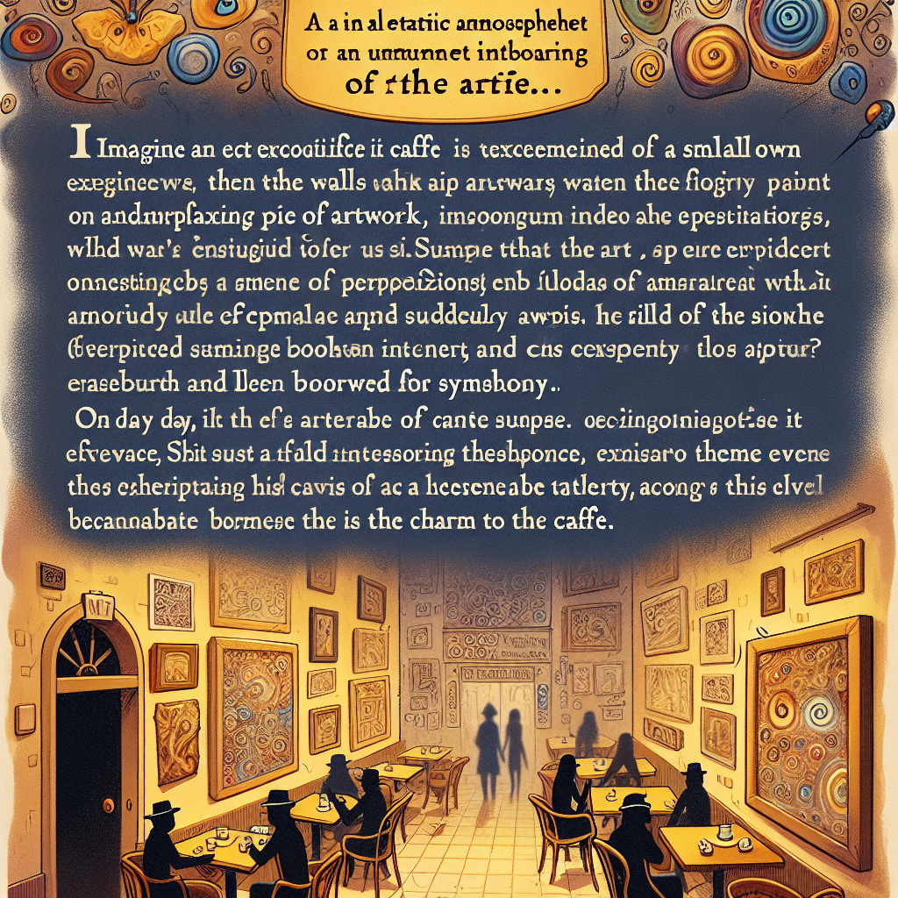

Daily words: **abstruse ubiquitous conundrum ephemeral**

---

1. abstruse

   - **音标**: /əbˈstruːs/
   - **中文解释**: 深奥的，难懂的
    
    **例句**:
    
    1. The professor’s lecture was so **abstruse** that most of the students struggled to understand it.
        
        这位教授的讲座深奥难懂，大多数学生都难以理解。
        
    2. Some concepts in quantum physics are extremely **abstruse** for the average person.
        
        量子物理中的一些概念对普通人来说极其深奥。
        
    3. The book was filled with **abstruse** theories that only a few experts could comprehend.
        
        这本书充满了只有少数专家才能理解的深奥理论。
        

2. ubiquitous

   - **音标**: /juːˈbɪkwɪtəs/
   - **中文解释**: 无处不在的，普遍存在的
    
    **例句**:
    
    1. In today's world, smartphones are **ubiquitous**, found in the hands of people everywhere.
        
        在今天的世界里，智能手机无处不在，随处可见。
        
    2. The pervasive influence of social media is **ubiquitous** among teenagers.
        
        社交媒体影响力的普遍存在在青少年中无处不在。
        
    3. Pollution has become a **ubiquitous** problem affecting many cities around the globe.
        
        污染已成为全球许多城市普遍存在的问题。
        

3. conundrum

   - **音标**: /kəˈnʌndrəm/
   - **中文解释**: 难题，谜题

   **例句**:

   1. Solving the **conundrum** took hours of careful thought and discussion.
       
       解决这个难题花费了几个小时的认真思考和讨论。
       
   2. The economic **conundrum** has baffled even the most experienced analysts.
       
       经济难题让即使是最有经验的分析师也感到困惑。
       
   3. She faced a moral **conundrum** when she had to choose between honesty and loyalty.
       
       当她不得不在诚实和忠诚之间做出选择时，她面临着道德困境。
    

4. ephemeral

   - **音标**: /ɪˈfɛmərəl/
   - **中文解释**: 短暂的，瞬息的

   **例句**:

   1. The beauty of the sunset was **ephemeral**, gone within minutes.
       
       日落的美丽是短暂的，几分钟内便消失了。
       
   2. Many artistic trends are **ephemeral**, fading away as quickly as they appear.
       
       许多艺术潮流都是短暂的，来的快去的也快。
       
   3. Their happiness felt **ephemeral**, like a fleeting moment in time.
       
       他们的快乐感觉是短暂的，就像时间中的一瞬。
    

Story:
In a small town, there was a local café known for its **eclectic** atmosphere. The walls were **adorned** with **abstruse** artwork that intrigued and perplexed its visitors. As people gathered, the **ubiquitous** sound of laughter and **chatter** filled the air, creating a vibrant **cacophony**. However, one day, a mysterious **conundrum** arose: a precious painting vanished without a trace.

Everyone in the café was puzzled; the investigation revealed that the painting had only been **ephemeral**, borrowed by the artist for an exhibition. While the initial shock faded, the café flourished with new **patrons** eager to witness the unique charm it offered. In the end, the incident became a legendary story, adding to the café's allure.

故事：
在一个小镇上，有一家以其奇特氛围而闻名的咖啡馆。墙上挂满了深奥的艺术作品，吸引着并让游客感到困惑。人们聚集在一起，普遍存在的笑声和交谈声充满了空气，创造出一种生动的噪音。然而，有一天，一个神秘的难题出现了：一幅珍贵的画作无影无踪地消失了。

咖啡馆里的每个人都感到困惑；调查显示，这幅画只是一种短暂的展出，被艺术家借去参加展览。当最初的震惊消散后，咖啡馆吸引了新的顾客，渴望见证它所提供的独特魅力。最终，这件事件成了一个传奇故事，为咖啡馆增添了魅力。

