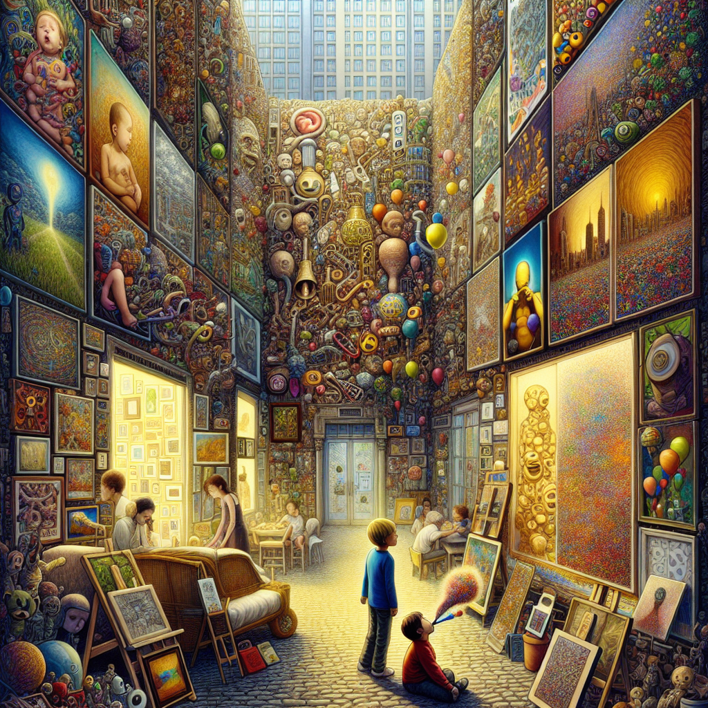

Daily words: **cacophony patron eclectic adorn adenoid**

## Words
### 1. cacophony
- 音标：/kæˈkɑːfəni/ <i class="fas fa-volume-up"></i>
<audio id="audio-player-1" src="audios/words/cacophony.mp3" style="display:none;"></audio>
- 中文解释：n. 刺耳的音调；不和谐音
- 例句：
1. The cacophony of the city streets made it hard to concentrate. (城市街道的噪音让人难以集中注意力。)
2. A cacophony erupted as the crowd cheered for their team. (当人群为他们的队伍欢呼时，爆发出一阵嘈杂声。)
3. The teacher asked the students to quiet down the cacophony in the classroom. (老师要求学生们安静下来，控制教室里的嘈杂声。)

### 2. patron
- 音标：/ˈpeɪtrən/ <i class="fas fa-volume-up"></i>
<audio id="audio-player-2" src="audios/words/patron.mp3" style="display:none;"></audio>
- 中文解释：n.（艺术家的）赞助人，资助者；代言人
- 例句：
1. The local artist was grateful for the patron who funded her gallery. (当地艺术家对资助她画廊的赞助人心存感激。)
2. The restaurant has a loyal patron who visits every week. (这家餐厅有一位忠实的顾客，每周都会来。)
3. Many patrons of the theater enjoy the live performances. (许多剧院的观众喜欢现场表演。)

### 3. eclectic
- 音标：/ɪˈklɛktɪk/ <i class="fas fa-volume-up"></i>
<audio id="audio-player-3" src="audios/words/eclectic.mp3" style="display:none;"></audio>
- 中文解释：adj. 兼收并蓄的；不拘一格的；折中的
- 例句：
1. Her eclectic taste in music includes everything from classical to hip-hop. (她对音乐的广泛品味包括从古典到嘻哈的各种风格。)
2. The decor of the cafe is eclectic, featuring vintage and modern furniture. (咖啡馆的装饰风格多样，包含复古和现代家具。)
3. He has an eclectic collection of books from various genres. (他有一个来自不同类型的广泛书籍收藏。)

### 4. adorn
- 音标：/əˈdɔːrn/ <i class="fas fa-volume-up"></i>
<audio id="audio-player-4" src="audios/words/adorn.mp3" style="display:none;"></audio>
- 中文解释：v. 装饰；使生色
- 例句：
1. She wanted to adorn her room with beautiful paintings. (她想用美丽的画作装饰她的房间。)
2. The holiday lights adorned the streets beautifully. (节日的灯饰美丽地装点了街道。)
3. They adorned the tree with colorful ornaments. (他们用五彩缤纷的装饰品装饰了树。)

### 5. adenoid
- 音标：/ˈædɪnɔɪd/ <i class="fas fa-volume-up"></i>
<audio id="audio-player-5" src="audios/words/adenoid.mp3" style="display:none;"></audio>
- 中文解释：腺样体
- 例句：
1. The doctor recommended surgery to remove the child's adenoids. (医生建议进行手术以切除孩子的腺样体。)
2. Enlarged adenoids can cause breathing difficulties in children. (腺样体肥大可能导致儿童呼吸困难。)
3. She frequently suffers from colds due to her enlarged adenoids. (由于腺样体肥大，她经常感冒。)

## Story
In a bustling city filled with cacophony, a local artist named Mia sought the support of a patron to fund her eclectic art gallery. Every inch of her gallery was adorned with vibrant paintings and sculptures that represented her diverse inspirations. Despite the noise outside, inside, the gallery was a haven for art lovers. Visitors often remarked on how the eclectic collection made them feel alive, as if each piece had a story to tell. However, one day, a young boy entered the gallery, his breathing labored due to enlarged adenoids. Mia noticed him admiring her work despite his discomfort and decided to organize an art show to raise funds for children's health, knowing how important it was to help those in need.

Mia's gallery became not only a place for art but also a beacon of hope for children in the community. The cacophony outside became a distant memory as the gallery thrived with laughter and creativity. Through her patron's support and her eclectic vision, Mia transformed her space into a vibrant sanctuary for all.

<audio controls>
<source src="https://files.dwong.top/story/2024-07-31-english.mp3" type="audio/mpeg">
你的浏览器不支持音频元素。
</audio>

在一个充满嘈杂声的繁华城市里，一位名叫米娅的当地艺术家寻求赞助人支持，以资助她的多样化艺术画廊。她的画廊每一寸都装饰着充满活力的画作和雕塑，代表着她多元的灵感。尽管外面很吵，但画廊内部是艺术爱好者的避风港。访客们常常评论说，这个多样化的藏品让他们感到活力四射，仿佛每一件作品都有故事要讲。然而，有一天，一个年轻男孩走进了画廊，由于腺样体肥大，他的呼吸艰难。米娅注意到他在欣赏她的作品，尽管他感到不适，决定组织一场艺术展，为儿童健康筹集资金，知道帮助有需要的人是多么重要。

米娅的画廊不仅成了艺术的殿堂，也成为社区儿童希望的灯塔。外面的嘈杂声成为遥远的记忆，画廊因笑声和创造力而繁荣。通过赞助人的支持和她多样化的愿景，米娅将她的空间转变为一个充满活力的庇护所，为所有人提供服务。

<audio controls>
<source src="https://files.dwong.top/story/2024-07-31-chinese.mp3" type="audio/mpeg">
你的浏览器不支持音频元素。
</audio>

