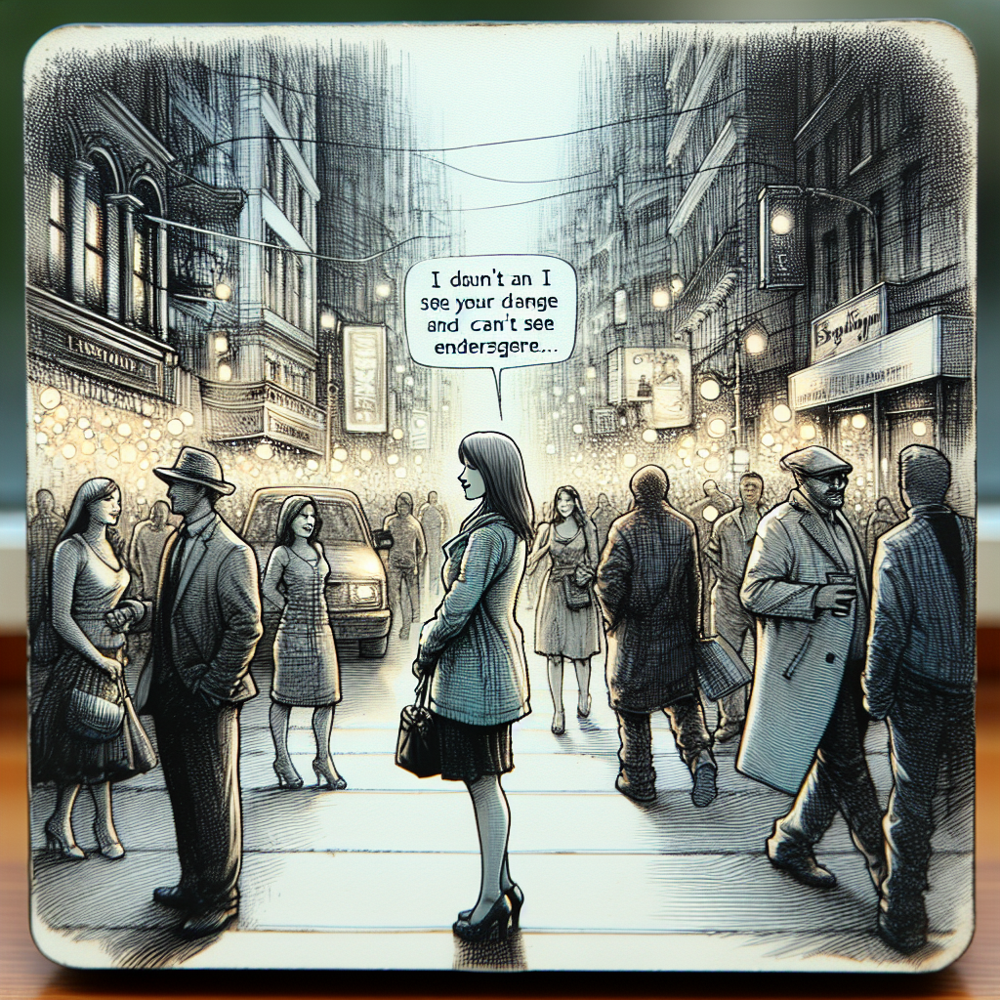

Daily words: **portray obscene intact miserable invade**

## Words
### 1. portray
- 音标：/pɔːrˈtreɪ/ <i class="fas fa-volume-up"></i>
<audio id="audio-player-1" src="audios/words/portray.mp3" style="display:none;"></audio>
- 中文解释：描绘，描写
- 例句：
1. The artist aims to portray the beauty of nature in her paintings.（这位艺术家的目标是通过她的画作描绘自然的美。）
2. The film tries to portray the struggles of a single mother.（这部电影试图描绘一个单身母亲的挣扎。）
3. He wanted to portray himself as a hero.（他想把自己描绘成一个英雄。）

### 2. obscene
- 音标：/əbˈsiːn/ <i class="fas fa-volume-up"></i>
<audio id="audio-player-2" src="audios/words/obscene.mp3" style="display:none;"></audio>
- 中文解释：猥亵的，下流的
- 例句：
1. The book was banned for its obscene content.（这本书因其猥亵内容而被禁止。）
2. He was criticized for making obscene jokes.（他因开下流玩笑而受到批评。）
3. The film contains some obscene scenes that are not suitable for children.（这部电影包含一些不适合儿童的猥亵场景。）

### 3. intact
- 音标：/ɪnˈtækt/ <i class="fas fa-volume-up"></i>
<audio id="audio-player-3" src="audios/words/intact.mp3" style="display:none;"></audio>
- 中文解释：完好无损的，完整的
- 例句：
1. The ancient ruins are still intact after centuries.（这些古代遗迹经过几个世纪仍然完好无损。）
2. She opened the package to find everything was intact.（她打开包裹发现一切都完好无损。）
3. The car was in an accident, but the interior remained intact.（这辆车发生了事故，但内部保持完好。）

### 4. miserable
- 音标：/ˈmɪzərəbəl/ <i class="fas fa-volume-up"></i>
<audio id="audio-player-4" src="audios/words/miserable.mp3" style="display:none;"></audio>
- 中文解释：痛苦的，悲惨的
- 例句：
1. He felt miserable after losing his job.（失去工作后，他感到痛苦。）
2. The weather was so miserable that we stayed indoors all day.（天气太糟糕了，我们整天都待在室内。）
3. She had a miserable experience during her vacation.（她在度假期间经历了一次悲惨的体验。）

### 5. invade
- 音标：/ɪnˈveɪd/ <i class="fas fa-volume-up"></i>
<audio id="audio-player-5" src="audios/words/invade.mp3" style="display:none;"></audio>
- 中文解释：侵入，侵扰
- 例句：
1. The army plans to invade the neighboring country.（军队计划入侵邻国。）
2. Don't invade my personal space when I'm working.（我工作时不要侵犯我的个人空间。）
3. The weeds began to invade the garden.（杂草开始侵扰花园。）

## Story
Once in a small town, an artist named Lila wanted to portray the beauty of her surroundings. She would spend hours painting the landscapes, making sure to keep everything intact. However, one day, an obscene figure appeared in her paintings, invading her artistic vision. Lila felt miserable as her once beautiful art was tainted. Determined to fight back, she decided to paint over the figure, reclaiming her canvas.

With each stroke, she transformed her artwork into something magnificent, showcasing not just the beauty, but also the resilience of her spirit. Lila learned that even in the face of obscenity and invasion, beauty can prevail.

<audio controls>
<source src="https://files.dwong.top/story/2024-08-01-english.mp3" type="audio/mpeg">
你的浏览器不支持音频元素。
</audio>

在一个小镇上，有一个名叫莉拉的艺术家，她想要描绘周围环境的美丽。她花了数小时画风景，确保一切完好无损。然而，有一天，一个猥亵的形象出现在她的画中，侵扰了她的艺术视野。莉拉感到痛苦，因为她曾经美丽的艺术被玷污了。决定反击的她，决定将那个形象重新涂抹，夺回她的画布。

随着每一次笔触，她把自己的艺术作品变成了壮丽的作品，不仅展现了美丽，也展示了她的坚韧精神。莉拉明白到，即使面对猥亵和侵害，美丽也能胜利。

<audio controls>
<source src="https://files.dwong.top/story/2024-08-01-chinese.mp3" type="audio/mpeg">
你的浏览器不支持音频元素。
</audio>

