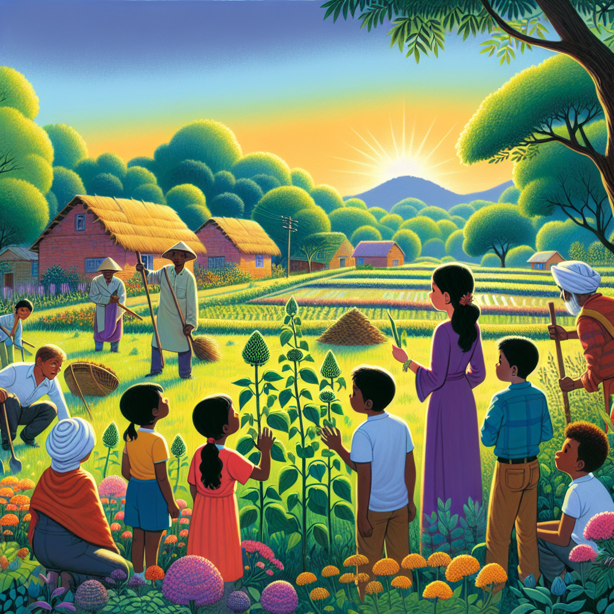

Daily words: indispensable inferior bark sustainability weed

## Words
### 1. indispensable
- 音标：/ˌɪndɪˈspensəbl/ <i class="fas fa-volume-up"></i>
<audio id="audio-player-1" src="audios/words/indispensable.mp3" style="display:none;"></audio>
- 解释：adj. 必不可少的
- 同根词：indispensability (n. /ˌɪndɪspənˈsɪbəlɪti/ 必不可少性)
- 例句：
1. Water is indispensable for life.
水是生命必不可少的。  
2. His knowledge is indispensable to our project.
他的知识对我们的项目是必不可少的。  
3. A good teacher is indispensable in a student’s education.
一位好的老师在学生的教育中是必不可少的。

### 2. inferior
- 音标：/ɪnˈfɪəriər/ <i class="fas fa-volume-up"></i>
<audio id="audio-player-2" src="audios/words/inferior.mp3" style="display:none;"></audio>
- 解释：adj. 劣等的，低下的; n. 下级
- 同根词：inferiority (n. /ɪnˌfɪəriˈɔːrɪti/ 劣等，低下)
- 例句：
1. The product was inferior to its competitors.
这个产品劣于其竞争对手。  
2. He felt a sense of inferiority in the group.
他在小组中感到一种劣等感。  
3. Inferior materials can lead to poor results.
劣质材料会导致糟糕的结果。

### 3. bark
- 音标：/bɑːrk/ <i class="fas fa-volume-up"></i>
<audio id="audio-player-3" src="audios/words/bark.mp3" style="display:none;"></audio>
- 解释：n. 树皮; v. 吠叫
- 同根词：barking (v. /ˈbɑːrkɪŋ/ 吠叫)
- 例句：
1. The tree's bark was rough and thick.
这棵树的树皮粗糙而厚。  
2. The dog began to bark at the stranger.
那只狗开始对陌生人吠叫。  
3. We used the bark of the tree for our craft project.
我们用树皮做我们的手工项目。

### 4. sustainability
- 音标：/səˌsteɪnəˈbɪləti/ <i class="fas fa-volume-up"></i>
<audio id="audio-player-4" src="audios/words/sustainability.mp3" style="display:none;"></audio>
- 解释：n. 可持续性
- 同根词：sustainable (adj. /səˈsteɪnəbl/ 可持续的)
- 例句：
1. Sustainability is important for the future of our planet.
可持续性对我们星球的未来很重要。  
2. They implemented sustainable practices in their business.
他们在业务中实施了可持续做法。  
3. The concept of sustainability includes environmental, social, and economic aspects.
可持续性的概念包括环境、社会和经济方面。

### 5. weed
- 音标：/wiːd/ <i class="fas fa-volume-up"></i>
<audio id="audio-player-5" src="audios/words/weed.mp3" style="display:none;"></audio>
- 解释：n. 杂草; v. 除草
- 同根词：weeding (v. /ˈwiːdɪŋ/ 除草)
- 例句：
1. We need to weed the garden this weekend.
我们这个周末需要除草。  
2. Some weeds can be harmful to crops.
一些杂草可能对农作物有害。  
3. He spent the afternoon weeding the flower beds.
他花了一个下午除杂草。

## Story
In a small village, sustainability was indispensable for the community's survival. Farmers worked hard to improve their techniques and avoid inferior products. They learned to use natural resources wisely, and even the bark from trees was repurposed for construction. One day, while weeding the garden, a group of children found a strange plant. They were curious and decided to investigate its properties, leading to an important discovery for their village. With their new knowledge, they shared their findings, ensuring a sustainable future for all.

<audio controls>
  <source src="https://files.dwong.top/story/2024-08-11-english.mp3" type="audio/mpeg">
  你的浏览器不支持音频元素。
</audio>
  

在一个小村庄里，可持续性对社区的生存至关重要。农民们努力改善自己的技术，避免劣质产品。他们学会明智地利用自然资源，甚至连树皮也被重新用于建筑。有一天，在除草时，一群孩子发现了一种奇怪的植物。他们很好奇，决定研究它的特性，导致了一个重要的发现。凭借新获得的知识，他们分享了自己的发现，确保了所有人的可持续未来。

<audio controls>
  <source src="https://files.dwong.top/story/2024-08-11-chinese.mp3" type="audio/mpeg">
  你的浏览器不支持音频元素。
</audio>
  

