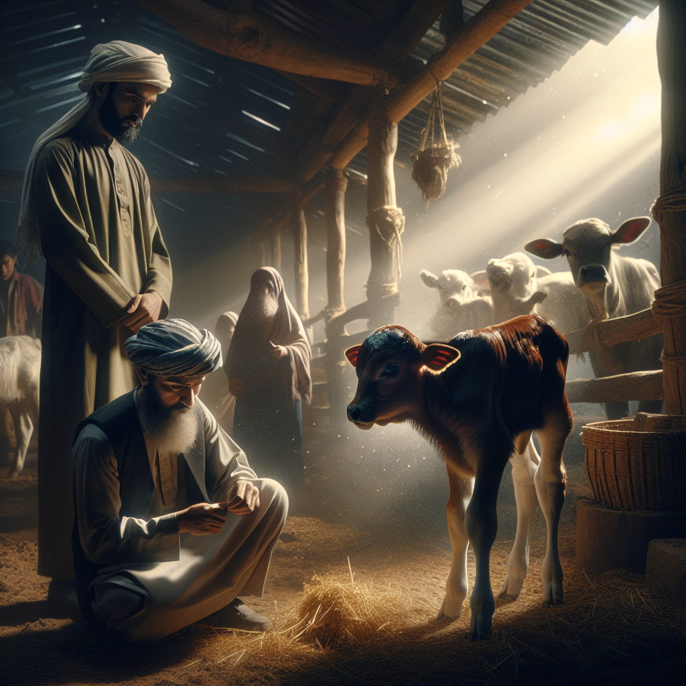

Daily words: standpoint calf serenity scrap moderate

## Words
### 1. standpoint
- 音标：/ˈstændpɔɪnt/ <i class="fas fa-volume-up"></i>
<audio id="audio-player-1" src="audios/words/standpoint.mp3" style="display:none;"></audio>
- 解释：n. 观点，立场
- 例句：
1. From my standpoint, education is the key to success.
从我的观点来看，教育是成功的关键。
2. The lawyer provided a legal standpoint on the issue.
律师提供了对这个问题的法律观点。
3. Her standpoint on climate change is very persuasive.
她对气候变化的观点非常有说服力。

### 2. calf
- 音标：/kæf/ <i class="fas fa-volume-up"></i>
<audio id="audio-player-2" src="audios/words/calf.mp3" style="display:none;"></audio>
- 解释：n. 小牛，幼兽
- 同根词：calves n. 小牛，幼兽
- 例句：
1. The farmer had a new calf in the barn.
农场里有一只新小牛。 
2. She fed the calf with a bottle of milk.
她用奶瓶喂小牛。 
3. The calf is playing in the field with its mother.
小牛正在和它的母亲在田野里玩耍。

### 3. serenity
- 音标：/səˈrɛnɪti/ <i class="fas fa-volume-up"></i>
<audio id="audio-player-3" src="audios/words/serenity.mp3" style="display:none;"></audio>
- 解释：n. 宁静，安详
- 例句：
1. The serenity of the lake was calming.
湖泊的宁静让人放松。 
2. She found serenity in her meditation practice.
她在冥想中找到了宁静。 
3. The garden was a place of serenity for the visitors.
这个花园是游客们的宁静之地。

### 4. scrap
- 音标：/skræp/ <i class="fas fa-volume-up"></i>
<audio id="audio-player-4" src="audios/words/scrap.mp3" style="display:none;"></audio>
- 解释：n. 废料，残片; v. 报废，取消
- 同根词：scrapped v. 报废，取消（过去分词）
- 例句：
1. They collected scrap metal for recycling.
他们收集废金属进行回收。 
2. The plan was scrapped after the meeting.
会议后这个计划被取消了。
3. I found a scrap of paper with some notes on it.
我找到了一片残片，上面有一些笔记。

### 5. moderate
- 音标：/ˈmɒdəreɪt/ <i class="fas fa-volume-up"></i>
<audio id="audio-player-5" src="audios/words/moderate.mp3" style="display:none;"></audio>
- 解释：adj. 适度的，有节制的; v. 适度，节制
- 同根词：moderation n. 适度，节制
- 例句：
1. It is important to eat in moderation for a healthy lifestyle.
为了健康的生活方式，适度饮食是很重要的。
2. The weather has been moderate this week.
这周的天气很适中。
3. He moderated the discussion to keep it on track.
他适度引导了讨论，以保持主题。

## Story
Once upon a time, there was a farmer who had a new calf in his barn. Despite his busy life, he found serenity in the quiet moments spent with his animals. One day, he decided to scrap the plans of expanding his farm and focused on the quality of life for his livestock instead. His standpoint was clear: a moderate lifestyle leads to happiness. Everyone in the village admired how he balanced work and relaxation, and wished they could share such serenity.

<audio controls>
  <source src="./audios/story/2024-08-13-english.mp3" type="audio/mpeg">
  你的浏览器不支持音频元素。
</audio>
  

从前，有一位农民在他的谷仓里养了一只新小牛。尽管他生活忙碌，但他在与动物们共度的安静时光中找到了宁静。一天，他决定取消扩建农场的计划，专注于提高动物的生活质量。他的观点很明确：适度的生活方式带来幸福。村里的人们都欣赏他如何平衡工作与放松，并希望能够分享这样的宁静。

<audio controls>
  <source src="./audios/story/2024-08-13-chinese.mp3" type="audio/mpeg">
  你的浏览器不支持音频元素。
</audio>
  

