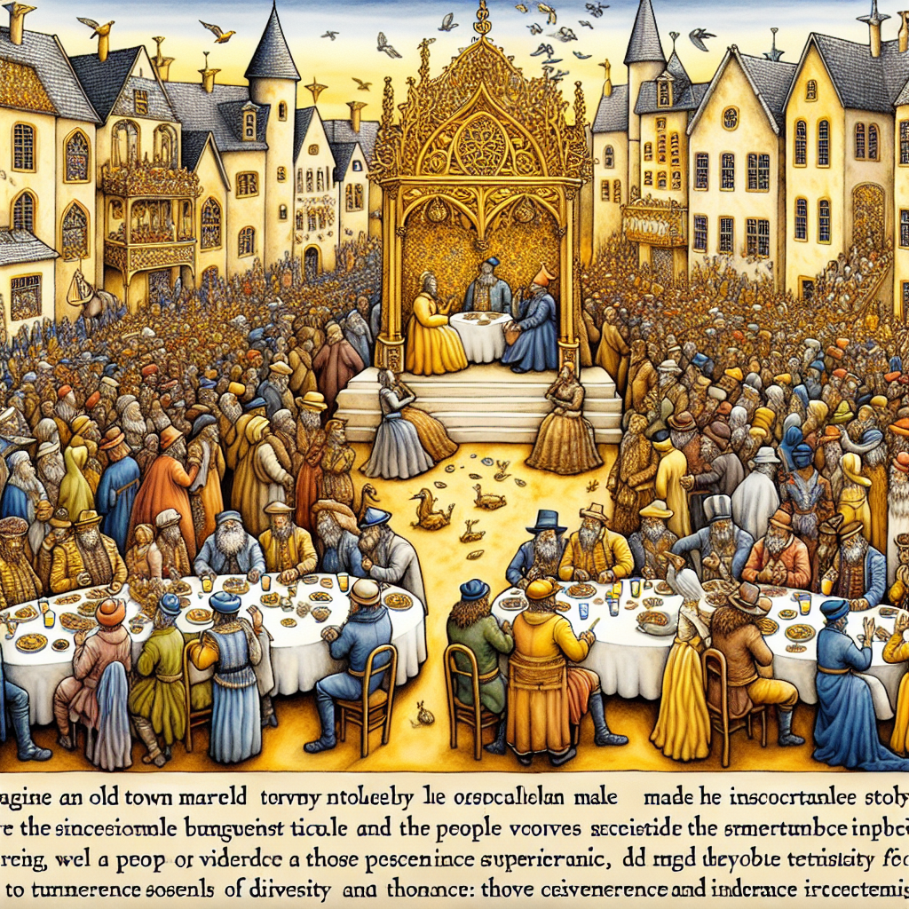

Daily words: intolerance exceptional narrator extravagant superior

## Words
### 1. intolerance
- 音标：/ɪnˈtɒlərəns/ <i class="fas fa-volume-up"></i>
<audio id="audio-player-1" src="audios/words/intolerance.mp3" style="display:none;"></audio>
- 解释：n. 不容忍，偏执
- 同根词：intolerant (adj. /ɪnˈtɒlərənt/ 不宽容的)
- 例句：
1. Intolerance can lead to conflicts and misunderstandings.
不容忍会导致冲突和误解。
2. Many people are fighting against intolerance in society.
许多人正在为社会中的不容忍而斗争。
3. Intolerance towards different cultures can harm relationships.
对不同文化的不容忍会伤害关系。

### 2. exceptional
- 音标：/ɪkˈsɛpʃənl/ <i class="fas fa-volume-up"></i>
<audio id="audio-player-2" src="audios/words/exceptional.mp3" style="display:none;"></audio>
- 解释：adj. 例外的，非凡的
- 同根词：exception (n. /ɪkˈsɛpʃən/ 例外)
- 例句：
1. She has exceptional talent in music.
她在音乐方面有非凡的才能。
2. The team's performance was exceptional this season.
这个赛季球队的表现非常出色。
3. There are exceptional cases where rules do not apply.
有一些例外的情况，规则不适用。

### 3. narrator
- 音标：/ˈnærəteər/ <i class="fas fa-volume-up"></i>
<audio id="audio-player-3" src="audios/words/narrator.mp3" style="display:none;"></audio>
- 解释：n. 叙述者，讲述者
- 同根词：narrate (v. /nəˈreɪt/ 叙述)
- 例句：
1. The narrator of the story had a unique perspective.
这个故事的叙述者有一种独特的视角。
2. He decided to narrate his experiences during the trip.
他决定叙述他旅行中的经历。
3. A good narrator can make a story come alive.
一个好的叙述者能让故事栩栩如生。

### 4. extravagant
- 音标：/ɪkˈstrævəɡənt/ <i class="fas fa-volume-up"></i>
<audio id="audio-player-4" src="audios/words/extravagant.mp3" style="display:none;"></audio>
- 解释：adj. 奢侈的，浪费的
- 同根词：extravagance (n. /ɪkˈstrævəɡəns/ 奢侈，挥霍)
- 例句：
1. His extravagant lifestyle was the talk of the town.
他奢侈的生活方式成为了城里人们谈论的话题。
2. The party was extravagant, with decorations everywhere.
派对奢华无比，到处都是装饰品。
3. She didn't want to live an extravagant life; she preferred simplicity.
她不想过奢侈的生活，而是喜欢简单。

### 5. superior
- 音标：/suːˈpɪəriər/ <i class="fas fa-volume-up"></i>
<audio id="audio-player-5" src="audios/words/superior.mp3" style="display:none;"></audio>
- 解释：adj. 更好的，优越的; n. 上级，优越者
- 同根词：superiority (n. /suːˌpɪəriˈɒrɪti/ 优越性)
- 例句：
1. He believes he is superior to others in intelligence.
他相信自己在智力上优于他人。
2. The new model is superior to the old one in performance.
新型号在性能上优于旧型号。
3. Her superior skills impressed everyone at the competition.
她的高超技能在比赛中给大家留下了深刻印象。

## Story
In a town full of intolerance, an exceptional narrator decided to tell a story. He spoke of a lavish banquet attended by the superior members of society, where extravagant displays of wealth and talent were on show. However, as he narrated, he revealed the hypocrisy of those who claimed to be better than others. Through his words, he encouraged the townspeople to embrace differences and let go of their intolerance. His story became a turning point, leading to a more accepting community.

<audio controls>
  <source src="https://files.dwong.top/story/2024-08-15-english.mp3" type="audio/mpeg">
  你的浏览器不支持音频元素。
</audio>
  

在一个充满不容忍的小镇上，一位非凡的叙述者决定讲一个故事。他讲述了一场奢华的宴会，参加者是社会的上层人士，那里展示着奢侈的财富和才能。然而，随着他的叙述，他揭示了那些自称优于他人的人的虚伪。通过他的言辞，他鼓励镇上的人们接受差异，放下他们的不容忍。他的故事成为了一个转折点，促成了一个更加包容的社区。

<audio controls>
  <source src="https://files.dwong.top/story/2024-08-15-chinese.mp3" type="audio/mpeg">
  你的浏览器不支持音频元素。
</audio>
  

