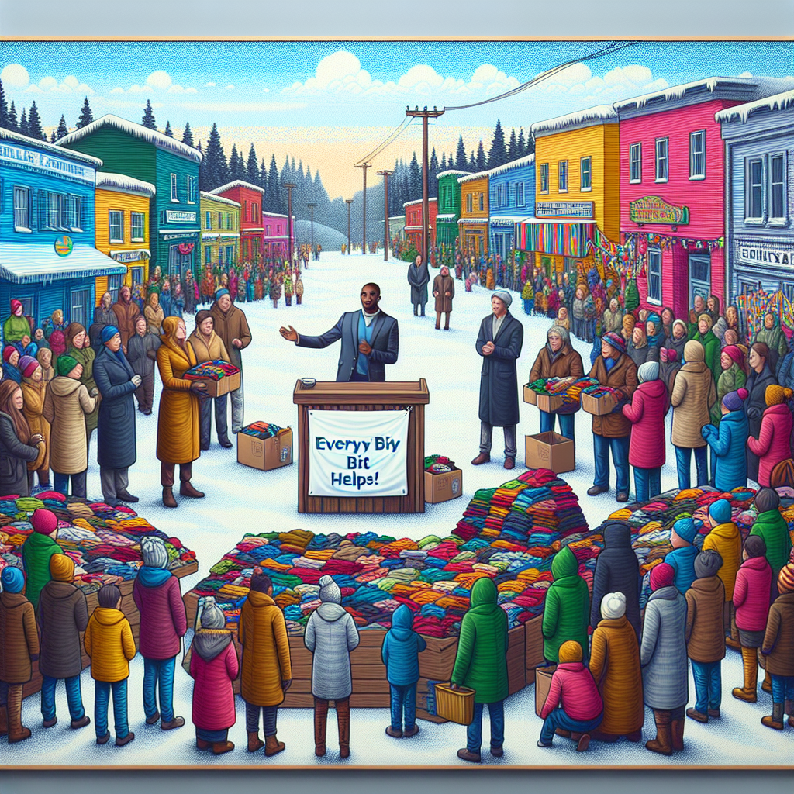

Daily words: undue donor colour ethical plead

## Words
### 1. undue
- 音标：/ʌnˈdjuː/ <i class="fas fa-volume-up"></i>
<audio id="audio-player-1" src="audios/words/undue.mp3" style="display:none;"></audio>
- 解释：adj. 过度的，不当的
- 例句：
1. The project faced undue criticism from the community.
这个项目遭到了社区的不当批评。
2. She felt undue pressure to perform well in her exams.
她感到在考试中有过度的压力。
3. It's not fair to place undue blame on one person.
把过多的责任都归咎于一个人是不公平的。

### 2. donor
- 音标：/ˈdəʊnə/ <i class="fas fa-volume-up"></i>
<audio id="audio-player-2" src="audios/words/donor.mp3" style="display:none;"></audio>
- 解释：n. 捐赠者
- 例句：
1. The donor contributed a large sum for the new library.
这位捐赠者为新图书馆捐赠了一大笔钱。
2. They are looking for a donor to support the research project.
他们正在寻找一位捐赠者来支持这个研究项目。
3. Many donors choose to remain anonymous.
许多捐赠者选择匿名。

### 3. colour
- 音标：/ˈkʌlə/ <i class="fas fa-volume-up"></i>
<audio id="audio-player-3" src="audios/words/colour.mp3" style="display:none;"></audio>
- 解释：n. 颜色; v. 给...上色
- 例句：
1. She loves the colour blue more than any other colour.
她比其他任何颜色都更喜欢蓝色。
2. The artist decided to colour the painting with vibrant hues.
艺术家决定用鲜艳的色调为画作上色。
3. Different cultures have different meanings associated with colour.
不同的文化对颜色有不同的含义。

### 4. ethical
- 音标：/ˈɛθɪkəl/ <i class="fas fa-volume-up"></i>
<audio id="audio-player-4" src="audios/words/ethical.mp3" style="display:none;"></audio>
- 解释：adj. 伦理的，道德的
- 例句：
1. It is important to make ethical decisions in business.
在商业中做出伦理决定是重要的。
2. The researchers followed ethical guidelines during the study.
研究人员在研究过程中遵循了伦理准则。
3. She questioned the ethical implications of the new policy.
她质疑新政策的伦理影响。

### 5. plead
- 音标：/pliːd/ <i class="fas fa-volume-up"></i>
<audio id="audio-player-5" src="audios/words/plead.mp3" style="display:none;"></audio>
- 解释：v. 恳求，辩护
- 例句：
1. He decided to plead for more time to complete the project.
他决定恳求更多时间来完成这个项目。
2. She pleads with her parents to let her attend the concert.
她恳求父母让她去参加音乐会。
3. The lawyer will plead his client's case in court.
律师将在法庭上为他的客户辩护。

## Story
Once, in a small town, there was a generous donor who wanted to make a difference. He noticed that the community was facing undue challenges during the winter months. To help, he organized a fundraising event. The event had vibrant colours all around, symbolizing hope and unity. Many people showed up to support the cause, and ethical practices were followed to ensure transparency. The donor pleaded with the crowd to contribute, saying, "Every little bit helps!" Thanks to his efforts, the town was able to provide warm clothing for those in need.

<audio controls>
  <source src="https://files.dwong.top/2024-08-19-english.mp3" type="audio/mpeg">
  你的浏览器不支持音频元素。
</audio>
  

在一个小镇上，有一位慷慨的捐赠者希望能有所改变。他注意到社区在冬天面临着过度的挑战。为了帮助大家，他组织了一场筹款活动。活动周围充满了生机勃勃的色彩，象征着希望和团结。许多人前来支持这个事业，遵循伦理做法以确保透明度。捐赠者向人群恳求说：“每一份帮助都是有意义的！”多亏了他的努力，这个小镇能够为有需要的人提供温暖的衣物。

<audio controls>
  <source src="https://files.dwong.top/2024-08-19-chinese.mp3" type="audio/mpeg">
  你的浏览器不支持音频元素。
</audio>
  

