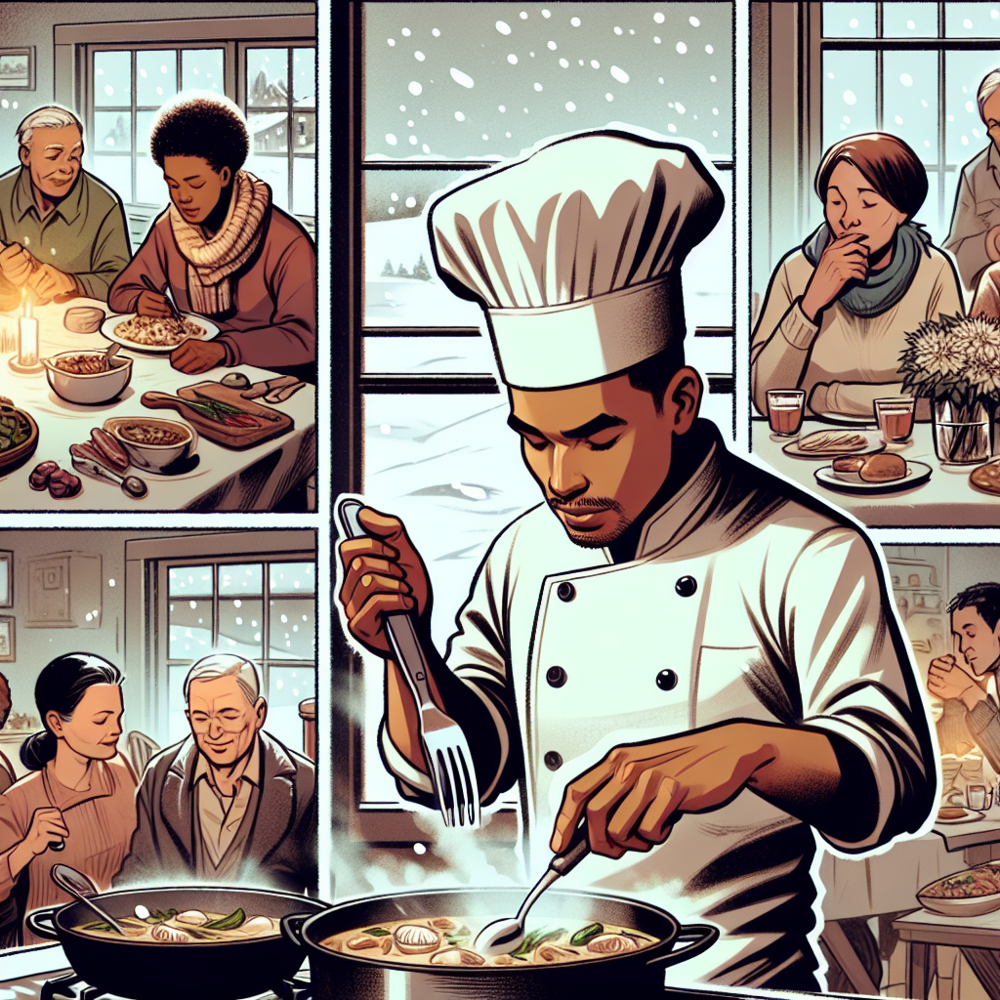

Daily words: fluctuate intensity stiff cutlery harshly

## Words
### 1. fluctuate
- 音标：/ˈflʌk.tʃu.eɪt/ <i class="fas fa-volume-up"></i>
<audio id="audio-player-1" src="audios/words/fluctuate.mp3" style="display:none;"></audio>
- 解释：v. 波动，起伏
- 同根词：fluctuation (n. /ˌflʌk.tʃuˈeɪ.ʃən/ 波动)
- 例句：
1. The temperature may fluctuate during the day. 这一天的温度可能会波动。
2. Prices will fluctuate based on supply and demand. 价格将根据供求关系波动。
3. His mood seems to fluctuate frequently. 他的情绪似乎经常波动。

### 2. intensity
- 音标：/ɪnˈtɛn.sɪ.ti/ <i class="fas fa-volume-up"></i>
<audio id="audio-player-2" src="audios/words/intensity.mp3" style="display:none;"></audio>
- 解释：n. 强度，强烈
- 同根词：intensify (v. /ɪnˈtɛn.sɪ.faɪ/ 加强)
- 例句：
1. The intensity of the light increased as the sun rose. 随着太阳的升起，光的强度增强。
2. She trains with great intensity every day. 她每天都以极大的强度训练。
3. The intensity of his feelings surprised her. 他情感的强烈程度让她感到惊讶。

### 3. stiff
- 音标：/stɪf/ <i class="fas fa-volume-up"></i>
<audio id="audio-player-3" src="audios/words/stiff.mp3" style="display:none;"></audio>
- 解释：adj. 僵硬的，刻板的
- 同根词：stiffen (v. /ˈstɪf.ən/ 使变硬)
- 例句：
1. The cold weather made my muscles feel stiff. 寒冷的天气使我的肌肉感到僵硬。
2. He had a stiff neck after sleeping poorly. 他睡不好觉后脖子僵硬。
3. The rules are too stiff for young players. 对年轻球员来说，规则太过刻板。

### 4. cutlery
- 音标：/ˈkʌt.lər.i/ <i class="fas fa-volume-up"></i>
<audio id="audio-player-4" src="audios/words/cutlery.mp3" style="display:none;"></audio>
- 解释：n. 餐具，刀具
- 例句：
1. The restaurant provided elegant cutlery for the dinner. 餐厅为晚餐提供了优雅的餐具。
2. She bought new cutlery for her kitchen. 她为厨房买了新餐具。
3. Don't forget to wash the cutlery after the meal. 吃完饭后不要忘记洗餐具。

### 5. harshly
- 音标：/ˈhɑːrʃ.li/ <i class="fas fa-volume-up"></i>
<audio id="audio-player-5" src="audios/words/harshly.mp3" style="display:none;"></audio>
- 解释：adv. 严厉地，刺耳地
- 同根词：harsh (adj. /hɑːrʃ/ 严厉的，粗糙的)
- 例句：
1. He spoke harshly to the children. 他对孩子们说话很严厉。
2. The winter wind blew harshly against her face. 冬天的风严厉地刮着她的脸。
3. The critic reviewed the movie harshly. 评论家对这部电影的评价很严厉。

## Story
One cold winter day, a chef decided to fluctuate the intensity of his cooking. He wanted to impress the guests with various flavors. However, he found his cutlery was too stiff to use effectively. As he prepared, he spoke harshly to himself, pushing through the difficulties. In the end, the meal was a success, and the guests enjoyed the intense flavors he had created.

<audio controls>
  <source src="https://files.dwong.top/story/2024-08-22-english.mp3" type="audio/mpeg">
  你的浏览器不支持音频元素。
</audio>
  

在一个寒冷的冬天，一位厨师决定在烹饪时调节强度。他想用不同的味道给客人留下深刻印象。然而，他发现他的餐具太僵硬，无法有效使用。在准备的过程中，他对自己说话很严厉，克服了困难。最后，这顿饭取得了成功，客人们都喜欢他创造的浓烈风味。

<audio controls>
  <source src="https://files.dwong.top/story/2024-08-22-chinese.mp3" type="audio/mpeg">
  你的浏览器不支持音频元素。
</audio>
  

