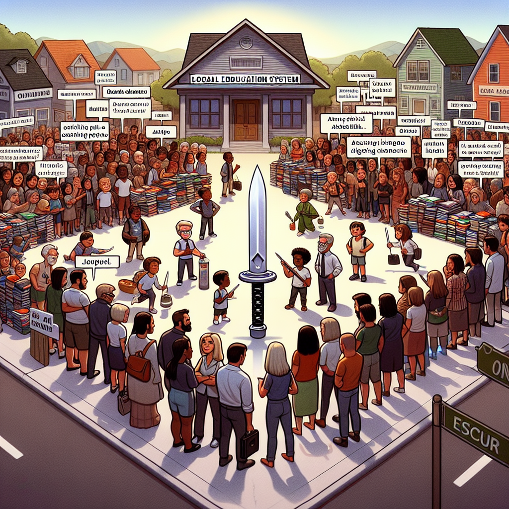

Daily words: polarize appendix syllabus escrow Katana

## Words
### 1. polarize
- 音标：/ˈpoʊləraɪz/ <i class="fas fa-volume-up"></i>
<audio id="audio-player-1" src="audios/words/polarize.mp3" style="display:none;"></audio>
- 解释：v. 使极化; 使两极分化
- 同根词：polarization (n. /ˌpoʊlərəˈzeɪʃən/ 极化；分化)
- 例句：
1. The debate on climate change tends to polarize public opinion. 这场关于气候变化的辩论往往使公众意见两极分化。
2. The artist's work can polarize viewers into strong supporters or critics. 这位艺术家的作品能够使观众分成强烈的支持者或批评者。
3. In politics, issues often polarize voters. 在政治中，问题往往使选民意见分化。

### 2. appendix
- 音标：/əˈpɛndɪks/ <i class="fas fa-volume-up"></i>
<audio id="audio-player-2" src="audios/words/appendix.mp3" style="display:none;"></audio>
- 解释：n. 附录，附加物
- 同根词：append (v. /əˈpɛnd/ 附加，附上)
- 例句：
1. The research paper included an appendix with additional data. 研究论文附带了一个包含额外数据的附录。
2. Please refer to the appendix for more details. 请参考附录以获取更多细节。
3. An appendix can provide useful information that supports the main text. 附录可以提供支持主文本的有用信息。

### 3. syllabus
- 音标：/ˈsɪləbəs/ <i class="fas fa-volume-up"></i>
<audio id="audio-player-3" src="audios/words/syllabus.mp3" style="display:none;"></audio>
- 解释：n. 课程大纲，教学计划
- 例句：
1. The syllabus outlines the topics we will cover this semester. 课程大纲列出了本学期我们将涵盖的主题。
2. Make sure to review the syllabus before the first class. 确保在第一节课之前复习课程大纲。
3. The syllabus includes important dates and deadlines. 课程大纲包括重要的日期和截止日期。

### 4. escrow
- 音标：/ˈɛskroʊ/ <i class="fas fa-volume-up"></i>
<audio id="audio-player-4" src="audios/words/escrow.mp3" style="display:none;"></audio>
- 解释：n. 佣金保管，托管
- 例句：
1. The funds were held in escrow until the deal was finalized. 资金在交易完成之前被保存在托管账户中。
2. We need to set up an escrow account for the transaction. 我们需要为这笔交易设置一个托管账户。
3. Escrow services can protect both buyers and sellers. 托管服务可以保护买卖双方。

### 5. katana
- 音标：/kəˈtɑːnə/ <i class="fas fa-volume-up"></i>
<audio id="audio-player-5" src="audios/words/katana.mp3" style="display:none;"></audio>
- 解释：n. 日本刀，武士刀
- 例句：
1. The samurai wielded a katana with great skill. 武士以高超的技艺挥舞着日本刀。
2. A katana is known for its curved blade and sharpness. 日本刀以其弯曲的刀刃和锋利而闻名。
3. Collectors often seek authentic katana from Japan. 收藏家们往往寻求来自日本的正宗日本刀。

## Story
In a small town, there was a debate about how to improve the local school syllabus. The argument seemed to polarize the community, with parents divided over new ideas. Some suggested adding an appendix of resources to help students. Others believed that a katana-like approach was necessary – sharp and focused changes to the curriculum. Meanwhile, an escrow account was proposed to manage funds for new programs. In the end, everyone agreed to work together to make the best decisions for the children.

<audio controls>
  <source src="./audios/story/2024-08-26-english.mp3" type="audio/mpeg">
  你的浏览器不支持音频元素。
</audio>
  

在一个小镇上，有关如何改善当地学校课程大纲的辩论引发了争议。争论似乎使社区分化，家长们对新想法意见不一。有些人建议增加一个附录，以帮助学生。另一些人认为应该采取类似于日本刀的方式——对课程进行锐利而集中的改变。与此同时，提议成立一个托管账户来管理新项目的资金。最后，每个人都同意共同努力，为孩子们做出最佳决定。

<audio controls>
  <source src="./audios/story/2024-08-26-chinese.mp3" type="audio/mpeg">
  你的浏览器不支持音频元素。
</audio>
  

