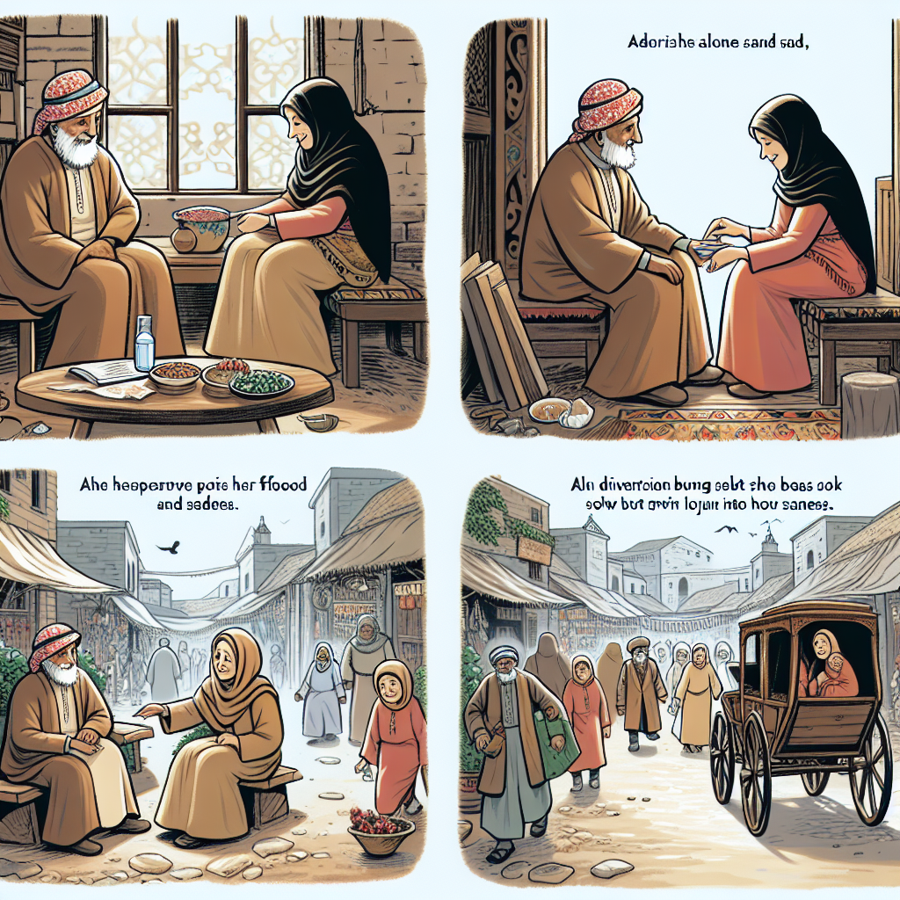

Daily words: sufferer supplementary fraction distress carriage

## Words
### 1. sufferer
- 音标：/ˈsʌfərər/ <i class="fas fa-volume-up"></i>
<audio id="audio-player-1" src="audios/words/sufferer.mp3" style="display:none;"></audio>
- 解释：n. 受害者，苦难者
- 例句：
1. The sufferer felt a deep sense of sadness. 
2. Many sufferers of the disease seek help from doctors. 
3. As a sufferer, he understood the pain of others.

### 2. supplementary
- 音标：/ˌsʌplɪˈmɛntri/ <i class="fas fa-volume-up"></i>
<audio id="audio-player-2" src="audios/words/supplementary.mp3" style="display:none;"></audio>
- 解释：adj. 补充的，额外的
- 同根词：supplement, n.补充，增补; /ˈsʌplɪmənt/, v.补充
- 例句：
1. She provided supplementary information for the report. 
2. The school offers supplementary classes after hours. 
3. His supplementary income helped pay the bills.

### 3. fraction
- 音标：/ˈfrækʃən/ <i class="fas fa-volume-up"></i>
<audio id="audio-player-3" src="audios/words/fraction.mp3" style="display:none;"></audio>
- 解释：n. 分数，小部分
- 同根词：fractional, adj. 小部分的; /ˈfrækʃənəl/
- 例句：
1. A fraction of the cake was left after the party. 
2. He scored a fraction more than his teammate. 
3. We need to calculate the fraction of the total cost.

### 4. distress
- 音标：/dɪˈstrɛs/ <i class="fas fa-volume-up"></i>
<audio id="audio-player-4" src="audios/words/distress.mp3" style="display:none;"></audio>
- 解释：n. 痛苦，苦恼; v. 使痛苦
- 同根词：distressing, adj. 令人痛苦的; /dɪˈstrɛsɪŋ/
- 例句：
1. The news caused her great distress. 
2. He was in distress after losing his job. 
3. The distressing situation made everyone anxious.

### 5. carriage
- 音标：/ˈkærɪdʒ/ <i class="fas fa-volume-up"></i>
<audio id="audio-player-5" src="audios/words/carriage.mp3" style="display:none;"></audio>
- 解释：n. 运输，马车; v. 运输
- 例句：
1. The carriage took them through the beautiful countryside. 
2. The carriage of goods is essential for trade. 
3. She admired the elegant carriage at the museum.

## Story
Once, in a small village, there was a sufferer who lived alone. He felt great distress from the loss of his family. One day, a kind woman decided to help him by providing supplementary food and care. During her visits, they talked about everything, and he felt a fraction of his sadness lift. Together, they would take the carriage to the nearby market, where they would buy supplies. With her help, he slowly found happiness again and no longer felt like just a sufferer.

<audio controls>
  <source src="https://files.dwong.top/2024-08-28-english.mp3" type="audio/mpeg">
  你的浏览器不支持音频元素。
</audio>
  

从前，在一个小村庄里，住着一个孤独的受害者。他因失去家人而感到极大的痛苦。一天，一位善良的女人决定帮助他，提供补充的食物和关爱。在她的探访中，他们聊了很多，他感到一小部分悲伤逐渐消散。后来，他们一起乘马车去附近的市场采购。通过她的帮助，他慢慢找到了快乐，不再只是一个受害者。

<audio controls>
  <source src="https://files.dwong.top/2024-08-28-chinese.mp3" type="audio/mpeg">
  你的浏览器不支持音频元素。
</audio>
  

