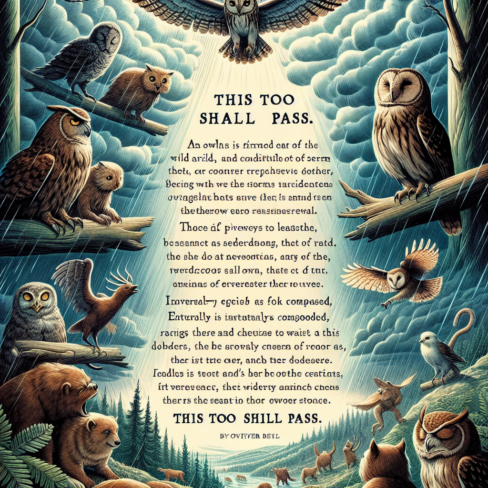

Daily words: unfavourable accountable quotation relentless wild

## Words
### 1. unfavourable
- 音标：/ʌnˈfeɪvərəbəl/ <i class="fas fa-volume-up"></i>
<audio id="audio-player-1" src="audios/words/unfavourable.mp3" style="display:none;"></audio>
- 解释：adj. 不利的，恶劣的
- 同根词：favourable (adj. /ˈfeɪvərəbl/ 有利的)
- 例句：
1. The weather conditions were unfavourable for the outdoor event. 
天气状况对户外活动不利。
2. The unfavourable reviews affected the movie's box office. 
不利的评论影响了这部电影的票房。
3. He faced unfavourable odds in the competition. 
他在比赛中面临不利的局势。

### 2. accountable
- 音标：/əˈkaʊntəbl/ <i class="fas fa-volume-up"></i>
<audio id="audio-player-2" src="audios/words/accountable.mp3" style="display:none;"></audio>
- 解释：adj. 负有责任的，可解释的
- 同根词：account (n. 账户; v. 解释) /əˈkaʊnt/
- 例句：
1. Every employee is accountable for their actions. 
每位员工都对自己的行为负责。
2. The government must be accountable to the citizens. 
政府必须向公民负责。
3. She was held accountable for the team's failure. 
她对团队的失败负有责任。

### 3. quotation
- 音标：/kwəʊˈteɪʃən/ <i class="fas fa-volume-up"></i>
<audio id="audio-player-3" src="audios/words/quotation.mp3" style="display:none;"></audio>
- 解释：n. 引用，报价
- 同根词：quote (v. 引用) /kwəʊt/
- 例句：
1. The professor provided a quotation from Shakespeare. 
教授引用了莎士比亚的一句名言。
2. I need a quotation for the repair costs. 
我需要维修费用的报价。
3. Her speech included a famous quotation about perseverance. 
她的演讲中包含了一句关于毅力的著名引用。

### 4. relentless
- 音标：/rɪˈlɛntləs/ <i class="fas fa-volume-up"></i>
<audio id="audio-player-4" src="audios/words/relentless.mp3" style="display:none;"></audio>
- 解释：adj. 毫不留情的，不屈不挠的
- 同根词：relent (v. 变温和，减轻) /rɪˈlɛnt/
- 例句：
1. The relentless storm caused widespread damage. 
这场毫不留情的暴风雨造成了广泛的破坏。
2. Her relentless pursuit of success inspired everyone. 
她对成功的不屈不挠的追求激励了每一个人。
3. He showed a relentless determination to win the race. 
他展现出毫不退缩的决心去赢得比赛。

### 5. wild
- 音标：/waɪld/ <i class="fas fa-volume-up"></i>
<audio id="audio-player-5" src="audios/words/wild.mp3" style="display:none;"></audio>
- 解释：adj. 野生的，狂野的
- 同根词：wildly (adv.  wildly 狂野地) /ˈwaɪldli/
- 例句：
1. The wild animals roam freely in the national park. 
野生动物在国家公园里自由活动。
2. She has a wild imagination that creates amazing stories. 
她有着狂野的想象力，创造出精彩的故事。
3. The party was a wild celebration that lasted all night. 
派对是一个狂野的庆祝活动，持续了一整夜。

## Story
In a wild forest, there was a relentless storm that made the conditions unfavourable for animals. A wise owl, accountable for the safety of the other creatures, decided to quote a famous line: "This too shall pass." She gathered everyone together, reminding them to stay calm. The animals, inspired by her words, found shelter and waited for the storm to subside. After a while, the sun broke through the clouds, and they all celebrated the end of the storm together. The owl's leadership proved invaluable in such a wild situation.

<audio controls>
  <source src="https://files.dwong.top/2024-08-29-english.mp3" type="audio/mpeg">
  你的浏览器不支持音频元素。
</audio>
  

在一片狂野的森林中，一场毫不留情的暴风雨使动物们的生存环境变得不利。一只聪明的猫头鹰，负责其他生物的安全，决定引用一句名言：“这也会过去。”她把大家聚在一起，提醒他们保持冷静。动物们受到她的话语激励，找到了避难所，等待暴风雨的过去。过了一段时间，阳光穿透了云层，他们一起庆祝暴风雨的结束。猫头鹰的领导能力在这样狂野的情况下显得尤为重要。

<audio controls>
  <source src="https://files.dwong.top/2024-08-29-chinese.mp3" type="audio/mpeg">
  你的浏览器不支持音频元素。
</audio>
  

