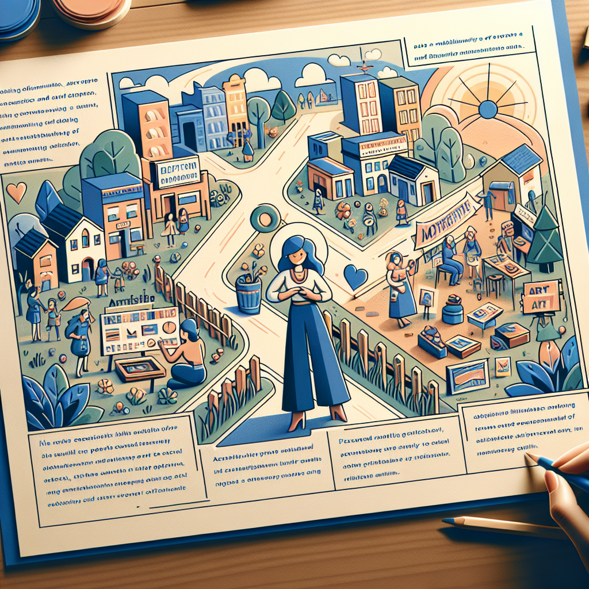

Daily words: meticulous appeal diplomatically equate discriminate

## Words
### 1. meticulous
- 音标：/məˈtɪkjələs/ <i class="fas fa-volume-up"></i>
<audio id="audio-player-1" src="audios/words/meticulous.mp3" style="display:none;"></audio>
- 解释：adj. 一丝不苟的，谨小慎微的
- 同根词：meticulously (adv. /məˈtɪkjələsli/ 细致地)
- 例句：
1. She is meticulous in her work, ensuring every detail is perfect. 
她在工作中一丝不苟，确保每一个细节都完美。  
2. The artist's meticulous approach to painting is what sets her apart. 
这位艺术家在绘画中细致的态度使她与众不同。  
3. He meticulously planned the event to avoid any problems. 
他一丝不苟地策划了这个活动，以避免任何问题。

### 2. appeal
- 音标：/əˈpiːl/ <i class="fas fa-volume-up"></i>
<audio id="audio-player-2" src="audios/words/appeal.mp3" style="display:none;"></audio>
- 解释：n. 吸引力; v. 呼吁，恳求
- 同根词：appealing (adj. /əˈpiːlɪŋ/ 吸引人的)
- 例句：
1. The movie has a strong appeal to young audiences. 
这部电影对年轻观众有很强的吸引力。  
2. She appealed to the crowd for help during the emergency. 
在紧急情况下，她向人群呼吁寻求帮助。  
3. His appealing personality makes him popular among his peers. 
他迷人的个性使他在同龄人中很受欢迎。

### 3. diplomatically
- 音标：/ˌdɪpləˈmætɪkli/ <i class="fas fa-volume-up"></i>
<audio id="audio-player-3" src="audios/words/diplomatically.mp3" style="display:none;"></audio>
- 解释：adv. 外交上，委婉地
- 同根词：diplomatic (adj. /ˌdɪpləˈmætɪk/ 外交的)
- 例句：
1. She handled the situation diplomatically to avoid conflict. 
她外交地处理了这个情况，以避免冲突。  
2. Diplomatically, it is important to maintain good relationships with other countries. 
在外交上，保持与其他国家的良好关系是很重要的。  
3. He diplomatically suggested a compromise that satisfied both parties. 
他委婉地建议了一个双方都满意的妥协。

### 4. equate
- 音标：/ɪˈkwet/ <i class="fas fa-volume-up"></i>
<audio id="audio-player-4" src="audios/words/equate.mp3" style="display:none;"></audio>
- 解释：v. 认为...等同于，把...看作相等
- 同根词：equation (n. /ɪˈ kweɪʒən/ 等式)
- 例句：
1. Many people equate success with wealth. 
许多人认为成功等同于财富。  
2. The scientists equate the two experiments to find similarities. 
科学家将这两个实验相等，以寻找相似之处。  
3. We should not equate appearance with character. 
我们不应该把外表与性格等同起来。

### 5. discriminate
- 音标：/dɪˈskrɪmɪneɪt/ <i class="fas fa-volume-up"></i>
<audio id="audio-player-5" src="audios/words/discriminate.mp3" style="display:none;"></audio>
- 解释：v. 区别，歧视
- 同根词：discrimination (n. /dɪˌskrɪmɪˈneɪʃən/ 歧视)
- 例句：
1. It's wrong to discriminate against someone based on their race. 
基于种族歧视别人是错误的。  
2. The study aims to discriminate between two different types of plants. 
这项研究旨在区分两种不同类型的植物。  
3. Discrimination in the workplace can lead to serious consequences. 
工作场所的歧视可能导致严重后果。

## Story
In a small town, there lived a meticulous artist who had an appealing personality. She always worked diplomatically with her clients, listening carefully to their needs. One day, she equated her love for art with her passion for helping others. However, she noticed that some people discriminated against local artists, believing only big city artists could succeed. Determined to change this perception, she organized an exhibition, showcasing the talent of local artists. The event was a huge success, bringing the community together and highlighting the beauty of their work.

<audio controls>
  <source src="https://files.dwong.top/story/2024-09-06-english.mp3" type="audio/mpeg">
  你的浏览器不支持音频元素。
</audio>
  

在一个小镇上，住着一位一丝不苟的艺术家，她个性迷人。她总是与客户外交地合作，仔细倾听他们的需求。有一天，她把对艺术的热爱与帮助他人的激情等同起来。然而，她发现有些人对当地艺术家存在歧视，认为只有大城市的艺术家才能成功。为了改变这种看法，她组织了一场展览，展示当地艺术家的才华。活动取得了巨大的成功，使社区团结在一起，彰显了他们作品的美。

<audio controls>
  <source src="https://files.dwong.top/story/2024-09-06-chinese.mp3" type="audio/mpeg">
  你的浏览器不支持音频元素。
</audio>
  

