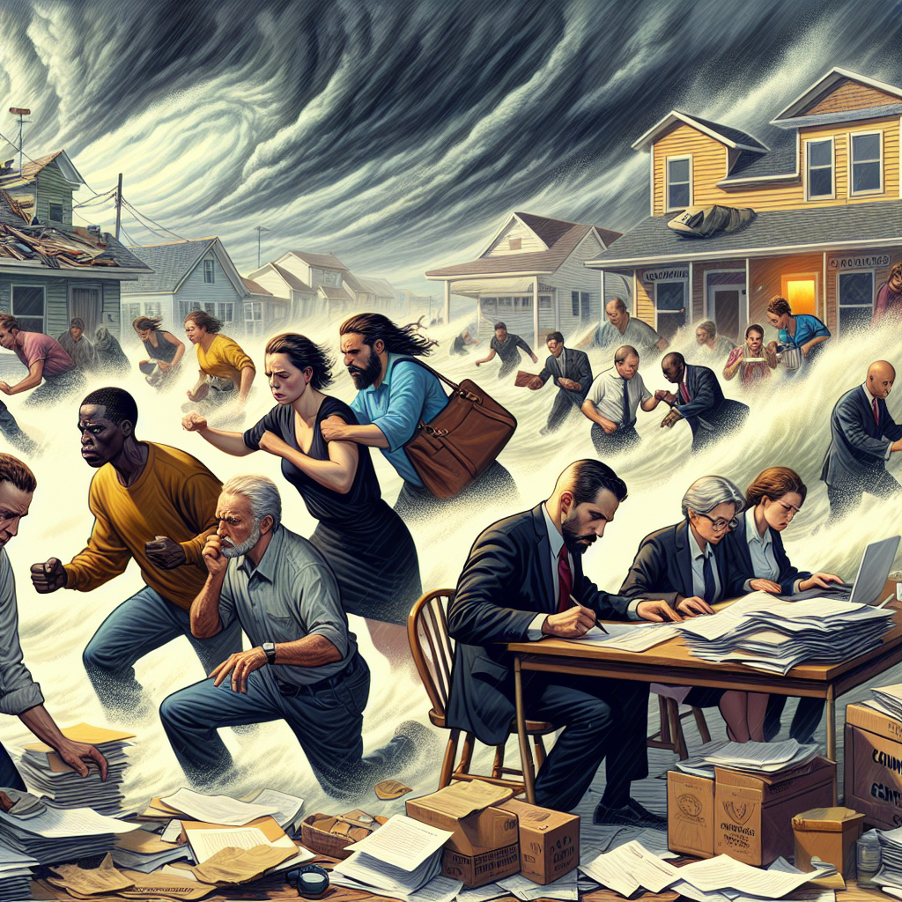

Daily words: catastrophe drift prosecution concession restless

## Words
### 1. catastrophe
- 音标：/kəˈtæs.trə.fi/ <i class="fas fa-volume-up"></i>
<audio id="audio-player-1" src="audios/words/catastrophe.mp3" style="display:none;"></audio>
- 解释：n. 灾难，毁灭性事件
- 同根词：catastrophic (adj. /ˌkæt.əˈstrɒf.ɪk/ 灾难性的), cataclysm (n. /ˈkæt.ə.klɪz.əm/ 大灾难)
- 例句：
1. The earthquake was a catastrophe that affected thousands of lives.
    这次地震是一次灾难，影响了成千上万的生命。
2. Many people believe that climate change will lead to a global catastrophe.
    很多人相信气候变化将导致全球灾难。
3. The company's financial catastrophe forced them to close down.
    公司的财务灾难迫使他们关闭。

### 2. drift
- 音标：/drɪft/ <i class="fas fa-volume-up"></i>
<audio id="audio-player-2" src="audios/words/drift.mp3" style="display:none;"></audio>
- 解释：v. 漂流; n. 漂流，趋势
- 同根词：drifter (n. /ˈdrɪf.tər/ 漂流者), drifting (adj. /ˈdrɪf.tɪŋ/ 漂流的)
- 例句：
1. The leaves began to drift slowly down from the trees.
    树叶开始慢慢从树上飘落。
2. He started to drift off during the boring lecture.
    在无聊的讲座中他开始打瞌睡。
3. The boat began to drift away from the shore.
    小船开始漂离岸边。

### 3. prosecution
- 音标：/ˌprɒs.ɪˈkjuː.ʃən/ <i class="fas fa-volume-up"></i>
<audio id="audio-player-3" src="audios/words/prosecution.mp3" style="display:none;"></audio>
- 解释：n. 起诉，检察
- 同根词：prosecute (v. /ˈprɒs.ɪ.kjuːt/ 起诉), prosecutorial (adj. /ˌprɒs.ɪ.kjuˈtɔː.ri.əl/ 起诉的)
- 例句：
1. The prosecution presented strong evidence against the defendant.
    检方提出了有力的证据对被告进行起诉。
2. She decided to prosecute the case herself.
    她决定自己起诉这个案件。
3. The prosecution's case was built on several eyewitness testimonies.
    检方的案件建立在几位目击者的证词之上。

### 4. concession
- 音标：/kənˈseʃ.ən/ <i class="fas fa-volume-up"></i>
<audio id="audio-player-4" src="audios/words/concession.mp3" style="display:none;"></audio>
- 解释：n. 让步，承认; 特许权
- 同根词：concede (v. /kənˈsiːd/ 让步，承认), concessive (adj. /kənˈsɛs.ɪv/ 让步的)
- 例句：
1. After long negotiations, they finally reached a concession.
    经过长时间的谈判，他们最终达成了一项让步。
2. The company made a concession on the price to attract more customers.
    公司在价格上做出了让步，以吸引更多客户。
3. He had to make a concession to keep the peace in the team.
    他必须做出让步以保持团队的和谐。

### 5. restless
- 音标：/ˈrɛs.tləs/ <i class="fas fa-volume-up"></i>
<audio id="audio-player-5" src="audios/words/restless.mp3" style="display:none;"></audio>
- 解释：adj. 焦虑的，得不到安宁的
- 同根词：restlessness (n. /ˈrɛs.tləs.nəs/ 焦躁不安), unrest (n. /ʌnˈrɛst/ 动荡，不安)
- 例句：
1. She felt restless during the long flight.
    在漫长的飞行中，她感到不安。
2. The restless crowd began to voice their concerns.
    不安的群众开始表达他们的担忧。
3. His restless mind kept him awake at night.
    他焦虑不安的思想让他晚上无法入睡。

## Story
In a small town, a catastrophe struck when a massive storm hit the area. People were restless as they drifted from their homes, seeking shelter. The local government had to make a concession, allowing residents to stay in the community center. Meanwhile, the prosecution was busy handling cases related to the disaster. They aimed to ensure that those responsible for the negligence would be held accountable. The townsfolk were united, determined to rebuild their lives despite the challenges they faced.

<audio controls>
  <source src="./audios/story/2024-09-08-english.mp3" type="audio/mpeg">
  你的浏览器不支持音频元素。
</audio>
  

在一个小镇，一场灾难降临，当一场巨大的风暴袭击该地区时。人们感到不安，漂流出家园，寻求避难所。当地政府不得不做出让步，允许居民留在社区中心。与此同时，检方忙于处理与灾难相关的案件。他们旨在确保那些因失职而负责的人受到惩罚。镇上的人们团结一致，决心在面临挑战的情况下重建生活。

<audio controls>
  <source src="./audios/story/2024-09-08-chinese.mp3" type="audio/mpeg">
  你的浏览器不支持音频元素。
</audio>
  

