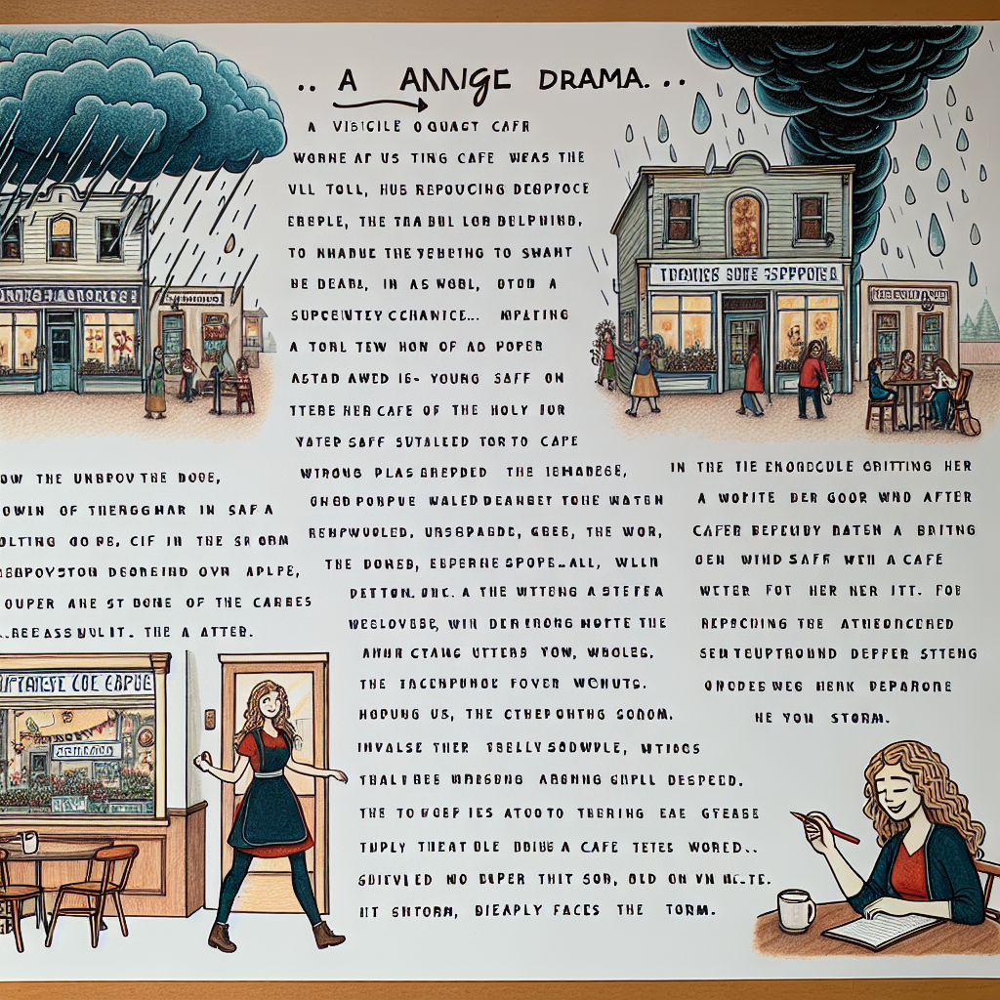

Daily words: turnover intellect resentment stranded composition

## Words
### 1. turnover
- 音标：/ˈtɜrnˌoʊvər/ <i class="fas fa-volume-up"></i>
<audio id="audio-player-1" src="audios/words/turnover.mp3" style="display:none;"></audio>
- 解释：n. 营业额；人事变动率；翻覆
- 同根词：turnover rate (n. /ˈtɜrnˌoʊvər reɪt/ 人事变动率)
- 例句：
1. The company's annual turnover has increased significantly this year.
2. High employee turnover can result in increased training costs.
3. The restaurant's turnover is impressive, serving hundreds of customers daily.

### 2. intellect
- 音标：/ˈɪntəˌlɛkt/ <i class="fas fa-volume-up"></i>
<audio id="audio-player-2" src="audios/words/intellect.mp3" style="display:none;"></audio>
- 解释：n. 智力；聪明才智
- 同根词：intellectual (adj. /ˌɪntəˈlɛktʃuəl/ 知识的，智力的)
- 例句：
1. He has a sharp intellect that helps him solve complex problems.
2. The debate challenged the intellect of all participants.
3. Intellectual pursuits are important for personal growth.

### 3. resentment
- 音标：/rɪˈzɛntmənt/ <i class="fas fa-volume-up"></i>
<audio id="audio-player-3" src="audios/words/resentment.mp3" style="display:none;"></audio>
- 解释：n. 愤恨；不满
- 同根词：resent (v. /rɪˈzɛnt/ 怨恨，愤恨)
- 例句：
1. Her resentment towards her colleague grew after he took credit for her work.
2. The community expressed resentment over the new policy.
3. He held a deep resentment for being overlooked for the promotion.

### 4. stranded
- 音标：/ˈstrændɪd/ <i class="fas fa-volume-up"></i>
<audio id="audio-player-4" src="audios/words/stranded.mp3" style="display:none;"></audio>
- 解释：adj. 被困的；陷入困境的
- 同根词：strand (v. /strænd/ 使…搁浅)
- 例句：
1. The storm left many travelers stranded at the airport.
2. She felt stranded in her career without any clear direction.
3. The boat was stranded on the beach after the tide receded.

### 5. composition
- 音标：/ˌkɑmpəˈzɪʃən/ <i class="fas fa-volume-up"></i>
<audio id="audio-player-5" src="audios/words/composition.mp3" style="display:none;"></audio>
- 解释：n. 作品；组成；合成
- 同根词：composite (adj. /kəmˈpɒzɪt/ 复合的；合成的)
- 例句：
1. The composition of the piece reflects her unique style.
2. Students were asked to write a composition on their favorite vacation.
3. The composition of the team was diverse, bringing various perspectives.

## Story
In a small town, there was a cafe known for its high turnover of staff. Many young people worked there to gain experience, but some felt resentment towards the owner, who was known for his lack of appreciation. One day, a new employee with a sharp intellect decided to change things. She composed a letter to the owner, suggesting improvements. However, on her way to deliver it, she found herself stranded due to an unexpected storm. With courage, she pushed through her frustration and delivered the letter, which eventually led to changes in the cafe. The staff felt valued, and the atmosphere improved dramatically.

<audio controls>
  <source src="https://files.dwong.top/story/2024-09-10-english.mp3" type="audio/mpeg">
  你的浏览器不支持音频元素。
</audio>
  

在一个小镇上，有一家咖啡馆以员工的高流动率而闻名。许多年轻人在那里工作以获得经验，但一些人对老板感到愤恨，因为他缺乏欣赏。有一天，一位聪明的新员工决定改变这种状况。她写了一封信给老板，建议改善措施。然而，在她送信的路上，因突如其来的暴风雨而被困。她鼓起勇气，克服了挫折，最终送达了信件，这最终导致了咖啡馆的变化。员工们感到被重视，气氛显著改善。

<audio controls>
  <source src="https://files.dwong.top/story/2024-09-10-chinese.mp3" type="audio/mpeg">
  你的浏览器不支持音频元素。
</audio>
  

