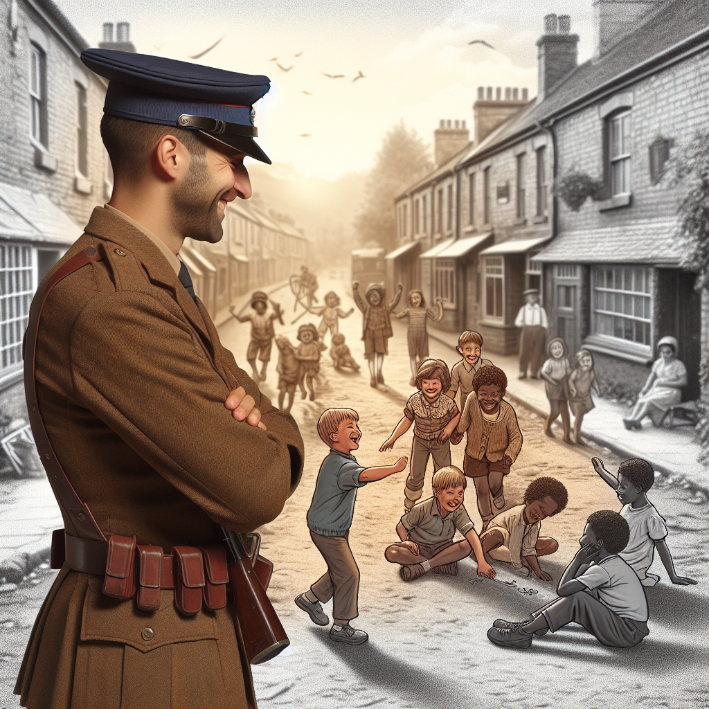

Daily words: vowel consonant invincible groove vigilant

## Words
### 1. vowel
- 音标：/ˈvaʊəl/ <i class="fas fa-volume-up"></i>
<audio id="audio-player-1" src="audios/words/vowel.mp3" style="display:none;"></audio>
- 解释：n. 元音
- 同根词：vowels (n. /ˈvaʊəlz/ 元音复数)
- 例句：
1. The English language has five vowel letters. 2. A vowel sound can change the meaning of a word. 3. In phonetics, vowels are important for understanding speech.

### 2. consonant
- 音标：/ˈkɑːnsənənt/ <i class="fas fa-volume-up"></i>
<audio id="audio-player-2" src="audios/words/consonant.mp3" style="display:none;"></audio>
- 解释：n. 辅音
- 同根词：consonants (n. /ˈkɑːnsənənts/ 辅音复数)
- 例句：
1. In the word "cat", the letter 'c' is a consonant. 2. There are 21 consonant letters in the English alphabet. 3. Consonants can be voiced or voiceless sounds.

### 3. invincible
- 音标：/ɪnˈvɪnsəbl/ <i class="fas fa-volume-up"></i>
<audio id="audio-player-3" src="audios/words/invincible.mp3" style="display:none;"></audio>
- 解释：adj. 不可战胜的
- 例句：
1. The team's invincible spirit led them to victory. 2. Many believed the hero was invincible. 3. She faced challenges with an invincible attitude.

### 4. groove
- 音标：/ɡruːv/ <i class="fas fa-volume-up"></i>
<audio id="audio-player-4" src="audios/words/groove.mp3" style="display:none;"></audio>
- 解释：n. 凹槽，槽，纹路; v. 沉迷于，享受
- 同根词：grooves (n. /ɡruːvz/ 凹槽复数)
- 例句：
1. The record had a deep groove that affected the sound. 2. I love to groove to my favorite music. 3. The artist created grooves in the sculpture for texture.

### 5. vigilant
- 音标：/ˈvɪdʒɪlənt/ <i class="fas fa-volume-up"></i>
<audio id="audio-player-5" src="audios/words/vigilant.mp3" style="display:none;"></audio>
- 解释：adj. 警惕的，警觉的
- 例句：
1. The vigilant guard noticed the suspicious activity. 2. It is important to be vigilant when crossing the street. 3. The vigilant parents ensured their children were safe.

## Story
In a small town, there lived a vigilant guard who kept watch day and night. He was known for his invincible spirit and never let his guard down. One day, while walking along the groove of the old road, he noticed a group of children playing. They were laughing and using their voices, mixing vowels and consonants in their games. The guard smiled, knowing that their joy was what he protected fiercely.

<audio controls>
  <source src="./audios/story/2024-09-12-english.mp3" type="audio/mpeg">
  你的浏览器不支持音频元素。
</audio>
  

在一个小镇上，住着一位警惕的守卫，昼夜守护。他以不可战胜的精神而闻名，从不放松警惕。一天，他在老路的凹槽旁散步时，注意到一群孩子在玩耍。他们在笑着，用元音和辅音混合在游戏中。守卫微笑着，知道他们的快乐是他守护的对象。

<audio controls>
  <source src="./audios/story/2024-09-12-chinese.mp3" type="audio/mpeg">
  你的浏览器不支持音频元素。
</audio>
  

