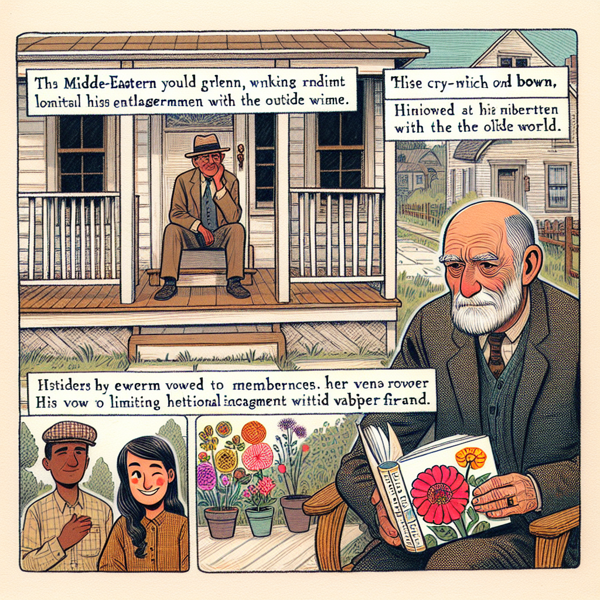

Daily words: cynical wink refrain classification snap

## Words
### 1. cynical
- 音标：/ˈsɪnɪkəl/ <i class="fas fa-volume-up"></i>
<audio id="audio-player-1" src="audios/words/cynical.mp3" style="display:none;"></audio>
- 解释：adj. 冷嘲热讽的，愤世嫉俗的
- 同根词：cynicism (n. /ˈsɪnɪˌsɪzəm/ 愤世嫉俗)
- 例句：
1. His cynical remarks made everyone uncomfortable.
他的冷嘲热讽让每个人都感到不安。
2. She has a cynical view of politics.
她对政治持有愤世嫉俗的看法。
3. Cynical people often doubt the intentions of others.
愤世嫉俗的人常常怀疑他人的意图。

### 2. wink
- 音标：/wɪŋk/ <i class="fas fa-volume-up"></i>
<audio id="audio-player-2" src="audios/words/wink.mp3" style="display:none;"></audio>
- 解释：v. 眨眼; n. 眨眼; 含意
- 同根词：winkingly (adv. /ˈwɪŋkɪŋli/ 眨眼地)
- 例句：
1. He gave me a wink to indicate he was joking.
他向我眨眼以表示他在开玩笑。
2. A wink can often convey more than words.
一个眨眼常常能传达比言语更多的意思。
3. She winked at him flirtatiously.
她调情地向他眨了眨眼。

### 3. refrain
- 音标：/rɪˈfreɪn/ <i class="fas fa-volume-up"></i>
<audio id="audio-player-3" src="audios/words/refrain.mp3" style="display:none;"></audio>
- 解释：v. 避免; n. 曲调，反复句
- 同根词：refrainment (n. /rɪˈfreɪnmənt/ 避免)
- 例句：
1. You should refrain from eating too much junk food.
你应该避免吃太多垃圾食品。
2. The refrain of the song was very catchy.
这首歌的反复句非常动听。
3. Refraining from shouting is important in a library.
在图书馆里避免高声喧哗是很重要的。

### 4. classification
- 音标：/ˌklæsɪfɪˈkeɪʃən/ <i class="fas fa-volume-up"></i>
<audio id="audio-player-4" src="audios/words/classification.mp3" style="display:none;"></audio>
- 解释：n. 分类，归类
- 同根词：classify (v. /ˈklæsɪfaɪ/ 分类)
- 例句：
1. The classification of animals is essential for understanding biodiversity.
动物的分类对理解生物多样性至关重要。
2. She works in a library and helps with book classification.
她在图书馆工作，帮助书籍分类。
3. Proper classification of data can improve research outcomes.
数据的正确分类可以改善研究结果。

### 5. snap
- 音标：/snæp/ <i class="fas fa-volume-up"></i>
<audio id="audio-player-5" src="audios/words/snap.mp3" style="display:none;"></audio>
- 解释：v. 啪地一声折断; n. 快照，啪嗒声
- 同根词：snapping (n. /ˈsnæpɪŋ/ 折断)
- 例句：
1. She heard a snap and realized the twig had broken.
她听到一声啪嗒，意识到树枝断了。
2. Take a snap of that beautiful sunset!
给那个美丽的日落拍张快照！
3. He made a snap decision without thinking it through.
他没有仔细考虑就做了个迅速的决定。

## Story
In a small town, there lived a cynical old man named Mr. Brown. He often sat on his porch, watching the world go by. One evening, he saw a young girl wink at her friend, and he couldn't help but smile. "Maybe there's still some joy in this world," he thought. However, his joy was short-lived as he remembered his vow to refrain from caring too much about others. One day, he stumbled upon a classification of flowers in a gardening book and decided to snap a picture of the vibrant blooms. The picture reminded him of happier times. Perhaps it was time for a change.

<audio controls>
  <source src="https://files.dwong.top/2024-09-15-english.mp3" type="audio/mpeg">
  你的浏览器不支持音频元素。
</audio>
  

在一个小镇上，住着一位愤世嫉俗的老者，名叫布朗先生。他常常坐在门廊上，看着世界的流逝。一天傍晚，他看到一个小女孩向她的朋友眨眼，不禁露出了微笑。“也许这个世界上还有一些快乐，”他想。然而，他的快乐并没有持续太久，因为他想起了自己发誓不再过于关心他人。有一天，他偶然发现一本园艺书中对花的分类，并决定拍一张色彩鲜艳的花朵照片。那张照片让他想起了更快乐的时光。也许，是时候改变了。

<audio controls>
  <source src="https://files.dwong.top/2024-09-15-chinese.mp3" type="audio/mpeg">
  你的浏览器不支持音频元素。
</audio>
  

