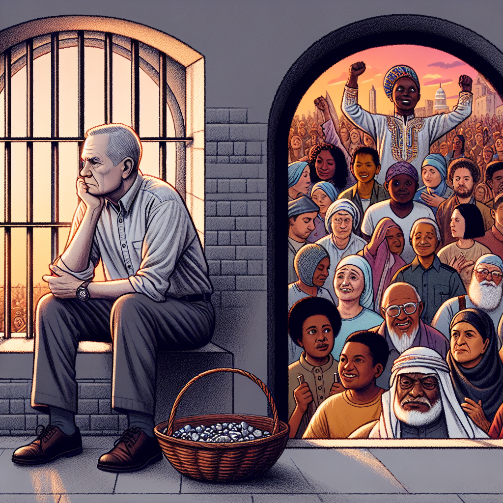

Daily words: convict vitally sustain inhabit casualty

## Words
### 1. convict
- 音标：/kənˈvɪkt/ <i class="fas fa-volume-up"></i>
<audio id="audio-player-1" src="audios/words/convict.mp3" style="display:none;"></audio>
- 解释：n. 罪犯; v. 定罪，宣告...有罪
- 同根词：conviction n. /kənˈvɪkʃən/ 定罪，信念; convicting v. /kənˈvɪktɪŋ/ 定罪的
- 例句：
1. The convict was sentenced to ten years in prison. 这名罪犯被判处十年监禁。
2. Her conviction in his innocence led her to fight for his release. 她对他无罪的信念让她为他的释放而斗争。
3. The convicting evidence presented in court was overwhelming. 法庭上提出的定罪证据令人信服。

### 2. vitally
- 音标：/ˈvaɪtəli/ <i class="fas fa-volume-up"></i>
<audio id="audio-player-2" src="audios/words/vitally.mp3" style="display:none;"></audio>
- 解释：adv. 重要地，生死攸关地; 垂死地
- 例句：
1. It is vitally important to stay hydrated during the summer. 夏天保持水分至关重要。
2. The project will vitally affect the community's future. 该项目将对社区的未来产生至关重要的影响。
3. She was vitally concerned about her family's health. 她对家人的健康非常关心。

### 3. sustain
- 音标：/səˈsteɪn/ <i class="fas fa-volume-up"></i>
<audio id="audio-player-3" src="audios/words/sustain.mp3" style="display:none;"></audio>
- 解释：v. 维持，支持; 经受，遭受
- 同根词：sustainable adj. /səˈsteɪnəbl/ 可持续的; sustenance n. /ˈsʌstənəns/ 维持生计的食物
- 例句：
1. The organization aims to sustain the local environment. 该组织的目标是维持当地环境。
2. He could not sustain the weight of the heavy box. 他无法承受那个重箱子的重量。
3. The farmer needs to find sustainable practices for his crops. 农民需要找到可持续的种植方式。

### 4. inhabit
- 音标：/ɪnˈhæbɪt/ <i class="fas fa-volume-up"></i>
<audio id="audio-player-4" src="audios/words/inhabit.mp3" style="display:none;"></audio>
- 解释：v. 居住于，栖息于
- 同根词：inhabitant n. /ɪnˈhæbɪtənt/ 居民; inhabitable adj. /ɪnˈhæbɪtəbl/ 适居的
- 例句：
1. The island is inhabited by many unique species of birds. 这个岛上栖息着许多独特的鸟类。
2. Each inhabitant has a story to tell. 每个居民都有一个故事可讲。
3. The area is not suitable for human habitation. 该地区不适合人类居住。

### 5. casualty
- 音标：/ˈkæʒuəlti/ <i class="fas fa-volume-up"></i>
<audio id="audio-player-5" src="audios/words/casualty.mp3" style="display:none;"></audio>
- 解释：n. 伤亡人员，意外事故; 不幸的人
- 同根词：casual adj. /ˈkæʒuəl/ 悠闲的; 偶然的; casualty rate n. /ˈkæʒuəlti reɪt/ 伤亡率
- 例句：
1. The accident resulted in several casualties. 这起事故造成了几名伤亡。
2. In times of war, the casualty rate can be very high. 在战争时期，伤亡率可能非常高。
3. He was a casualty of the economic crisis. 他是经济危机的受害者。

## Story
In a small town, there was a convict who had been wrongfully imprisoned for years. He was vitally concerned about his future and the impact of his incarceration on his family. As he tried to sustain hope, he learned that the town's inhabitants were planning a protest to fight for his freedom. The protest was crucial to raise awareness and reduce the number of casualties caused by wrongful convictions. Finally, the community came together, and justice was served, freeing the innocent man.

<audio controls>
  <source src="https://files.dwong.top/2024-09-18-english.mp3" type="audio/mpeg">
  你的浏览器不支持音频元素。
</audio>
  

在一个小镇上，有一名被错误监禁多年的罪犯。他对自己的未来，以及监禁对家庭的影响非常关心。当他努力维持希望时，得知镇上的居民们正在计划抗议，以争取他的自由。这次抗议对提高公众意识以及减少因错误定罪而造成的伤亡至关重要。最终，社区团结起来，正义得以伸张，释放了无辜的男子。

<audio controls>
  <source src="https://files.dwong.top/2024-09-18-chinese.mp3" type="audio/mpeg">
  你的浏览器不支持音频元素。
</audio>
  

