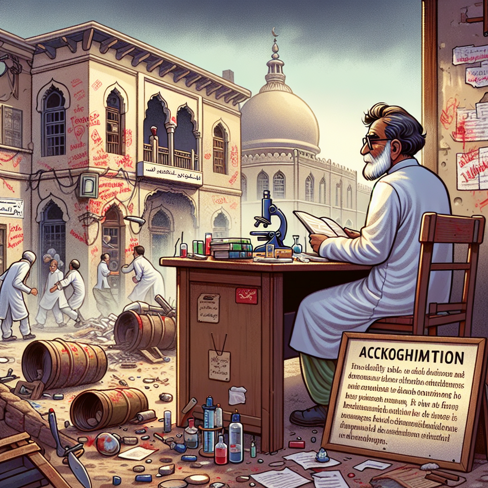

Daily words: dignified fanatic vandalism muddle eminent

## Words
### 1. dignified
- 音标：/ˈdɪɡ.nɪ.faɪd/ <i class="fas fa-volume-up"></i>
<audio id="audio-player-1" src="audios/words/dignified.mp3" style="display:none;"></audio>
- 解释：adj. 庄重的，显得有尊严的
- 同根词：dignify (v. /ˈdɪɡ.nɪ.faɪ/ 使...显得庄重)
- 例句：
1. He stood up in a dignified manner.  
他以庄重的态度站了起来。  
2. The dignified ceremony impressed everyone.  
庄重的仪式给每个人留下了深刻的印象。  
3. She remained dignified despite the criticism.  
尽管受到批评，她依然保持着尊严。

### 2. fanatic
- 音标：/fəˈnætɪk/ <i class="fas fa-volume-up"></i>
<audio id="audio-player-2" src="audios/words/fanatic.mp3" style="display:none;"></audio>
- 解释：n. 狂热者; adj. 狂热的
- 同根词：fanaticism (n. /fəˈnætɪsɪzəm/ 狂热主义)
- 例句：
1. The fanatic supported his team with all his heart.  
这个狂热者全心全意支持他的团队。  
2. She had a fanatic approach to her studies.  
她对学习采取了狂热的态度。  
3. His fanaticism sometimes frightened others.  
他的狂热有时让其他人感到害怕.

### 3. vandalism
- 音标：/ˈvæn.dəl.ɪ.zəm/ <i class="fas fa-volume-up"></i>
<audio id="audio-player-3" src="audios/words/vandalism.mp3" style="display:none;"></audio>
- 解释：n. 破坏行为，恶意损坏
- 例句：
1. The vandalism in the park was alarming.  
公园里的破坏行为令人担忧。  
2. They were charged with vandalism after the incident.  
事件发生后，他们被指控为破坏行为。  
3. The school took measures to prevent vandalism.  
学校采取措施以防止破坏行为.

### 4. muddle
- 音标：/ˈmʌd.əl/ <i class="fas fa-volume-up"></i>
<audio id="audio-player-4" src="audios/words/muddle.mp3" style="display:none;"></audio>
- 解释：v. 使混乱，搞糊涂; n. 混乱，困惑
- 同根词：muddled (adj. /ˈmʌd.əld/ 迷糊的)
- 例句：
1. I always muddle my keys with my phone.  
我总是把钥匙和手机搞混。  
2. The instruction was so muddled that I couldn't follow it.  
这个指示混乱不清，我无法遵循。  
3. Don't muddle the important documents together.  
不要把重要的文件搞混在一起.

### 5. eminent
- 音标：/ˈɛm.ɪ.nənt/ <i class="fas fa-volume-up"></i>
<audio id="audio-player-5" src="audios/words/eminent.mp3" style="display:none;"></audio>
- 解释：adj. 知名的，卓越的
- 同根词：eminence (n. /ˈɛm.ɪ.nəns/ 卓越，显赫)
- 例句：
1. He is an eminent scientist in his field.  
他是该领域的一位知名科学家。  
2. The conference featured several eminent speakers.  
会议有几位卓越的演讲者。  
3. Her contributions to medicine have made her eminent.  
她对医学的贡献使她声名显赫.

## Story
In a small town, there was an eminent scientist known for his dignified demeanor. However, one day, a group of fanatic youths decided to vandalize his lab in protest against his experiments. They thought their actions would gain attention, but instead, they only muddled their message. The scientist, undeterred by this vandalism, continued his work with dignity, hoping to educate the misguided fanatics about the importance of science.

<audio controls>
  <source src="./audios/story/2024-09-24-english.mp3" type="audio/mpeg">
  你的浏览器不支持音频元素。
</audio>
  

在一个小镇上，有一位以庄重举止而闻名的知名科学家。然而，有一天，一群狂热的年轻人决定在抗议他的实验时破坏他的实验室。他们认为自己的行为会引起关注，但实际上，只是混淆了他们的信息。这位科学家没有被破坏行为所阻碍，继续以尊严的态度工作，希望能教育这些误入歧途的狂热者科学的重要性。

<audio controls>
  <source src="./audios/story/2024-09-24-chinese.mp3" type="audio/mpeg">
  你的浏览器不支持音频元素。
</audio>
  

