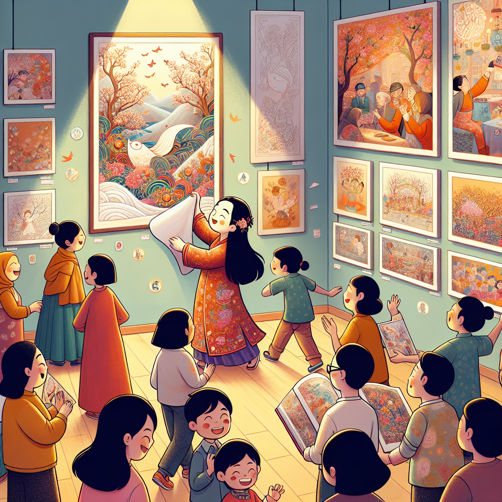

Daily words: illustration reserve superfluous irresistible superficially

## Words
### 1. illustration
- 音标：/ˌɪl.əˈstreɪ.ʃən/ <i class="fas fa-volume-up"></i>
<audio id="audio-player-1" src="audios/words/illustration.mp3" style="display:none;"></audio>
- 解释：n. 插图，例证
- 同根词：illustrative (adj. /ɪˈlʌs.trə.tɪv/ 说明的，图解的), illustrate (v. /ˈɪl.ə.streɪt/ 说明，阐明)
- 例句：
1. The book contained beautiful illustrations. 
这本书包含了美丽的插图。
2. The teacher used an illustration to explain the concept. 
老师用插图来解释这个概念。
3. Each illustration helped the students understand better. 
每幅插图都帮助学生更好地理解。

### 2. reserve
- 音标：/rɪˈzɜrv/ <i class="fas fa-volume-up"></i>
<audio id="audio-player-2" src="audios/words/reserve.mp3" style="display:none;"></audio>
- 解释：n. 储备，保留; v. 保留，预定
- 同根词：reservation (n. /ˌrɛzərˈveɪʃən/ 预定，保留), reserved (adj. /rɪˈzɜrvd/ 保留的，沉默寡言的)
- 例句：
1. We need to reserve a table for dinner. 
我们需要预定一个晚餐的桌子。
2. The reserve of food will last for weeks. 
这储备的食物会持续几周。
3. He is a reserved person and doesn't talk much. 
他是一个沉默寡言的人，话不多。

### 3. superfluous
- 音标：/suːˈpɜr.flu.əs/ <i class="fas fa-volume-up"></i>
<audio id="audio-player-3" src="audios/words/superfluous.mp3" style="display:none;"></audio>
- 解释：adj. 多余的，不必要的
- 同根词：superfluity (n. /ˌsuː.pɚˈfluː.ɪ.ti/ 过剩，多余)
- 例句：
1. The extra decorations were superfluous. 
额外的装饰是多余的。
2. He removed the superfluous details from his report. 
他从报告中删除了多余的细节。
3. Superfluous spending can lead to financial problems. 
多余的开支可能导致财务问题。

### 4. irresistible
- 音标：/ˌɪr.ɪˈzɪs.tə.bəl/ <i class="fas fa-volume-up"></i>
<audio id="audio-player-4" src="audios/words/irresistible.mp3" style="display:none;"></audio>
- 解释：adj. 不可抗拒的，诱人的
- 同根词：irresistibly (adv. /ˌɪr.ɪˈzɪs.tə.bli/ 不可抗拒地)
- 例句：
1. The chocolate cake was simply irresistible. 
这块巧克力蛋糕简直不可抗拒。
2. She has an irresistible charm that attracts everyone. 
她有一种不可抗拒的魅力，吸引着每一个人。
3. The offer was too irresistible to refuse. 
这个提议让人无法拒绝。

### 5. superficially
- 音标：/ˌsuː.pəˈfɪʃ.ə.li/ <i class="fas fa-volume-up"></i>
<audio id="audio-player-5" src="audios/words/superficially.mp3" style="display:none;"></audio>
- 解释：adv. 表面上，肤浅地
- 同根词：superficial (adj. /ˈsuː.pəˈfɪʃ.əl/ 表面的，肤浅的)
- 例句：
1. The problem seemed superficial at first. 
这个问题乍看上去似乎是表面的。
2. They only discussed the subject superficially. 
他们只是肤浅地讨论了这个话题。
3. Superficially, everything appeared to be fine. 
表面上，一切似乎都很好。

## Story
Once upon a time, there was a talented artist who created beautiful illustrations for a children's book. She had to reserve a special place in the gallery for the book launch. As the day approached, she realized that some decorations were superfluous, making the space feel cluttered. On the day of the event, her artwork was irresistible to everyone who attended, drawing in crowds. Although the gallery seemed small superficially, it was filled with joy and laughter, making the artist's heart soar with happiness.

<audio controls>
  <source src="./audios/story/2024-09-25-english.mp3" type="audio/mpeg">
  你的浏览器不支持音频元素。
</audio>
  

从前，有一位才华横溢的艺术家为一本儿童书籍创作了美丽的插图。她必须在画廊中预留一个特别的位置为书籍发布会。随着日子的临近，她意识到一些装饰是多余的，使空间显得杂乱无章。在活动当天，她的作品对所有参加者都具有不可抗拒的吸引力，吸引了人群。尽管画廊表面上显得很小，但里面充满了快乐与欢笑，让艺术家的心灵感到无比幸福。

<audio controls>
  <source src="./audios/story/2024-09-25-chinese.mp3" type="audio/mpeg">
  你的浏览器不支持音频元素。
</audio>
  

