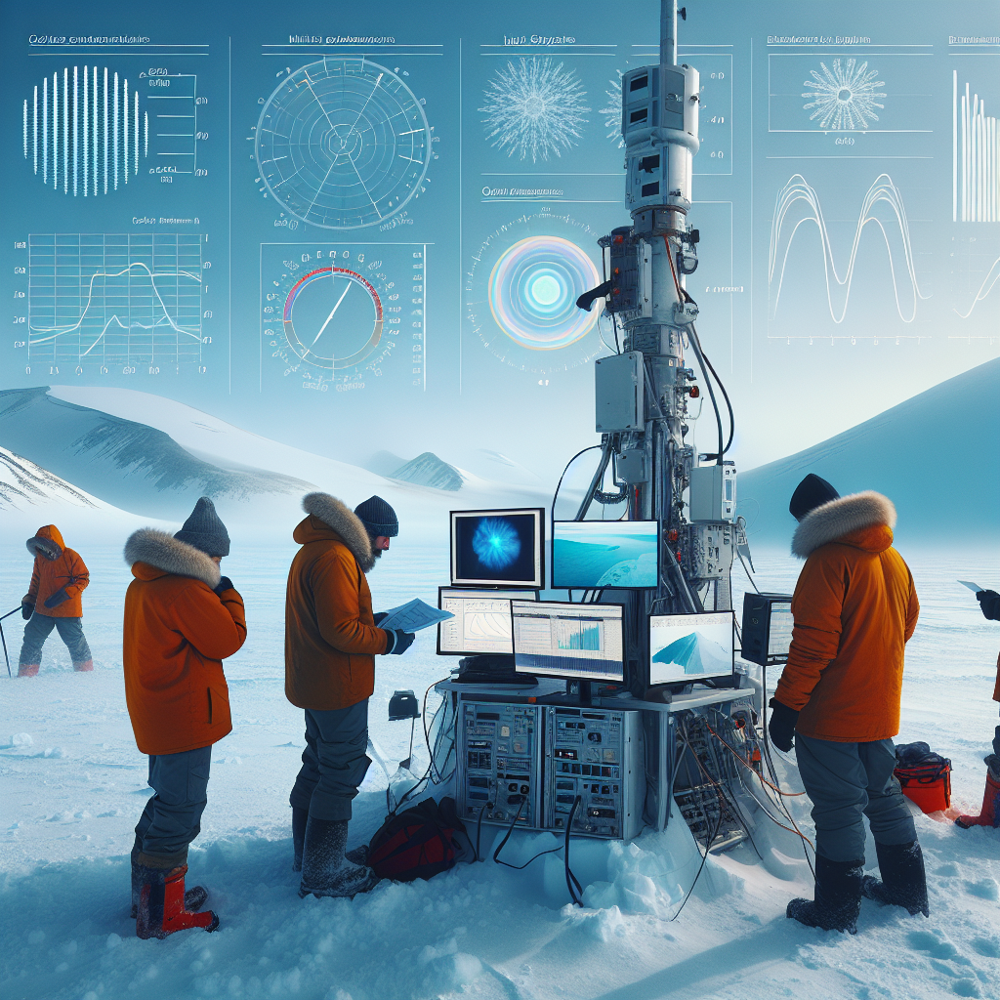

Daily words: pole spectrum combat constrain indicator

## Words
### 1. pole
- 音标：/poʊl/ <i class="fas fa-volume-up"></i>
<audio id="audio-player-1" src="audios/words/pole.mp3" style="display:none;"></audio>
- 解释：n. 杆，极； v. 用杆支撑
- 同根词：poles (n. 杆，极)
- 例句：
1. He climbed the pole to fix the wires.  他爬上杆子修理电线。 
2. The North Pole is a cold place.  北极是一个寒冷的地方。 
3. She used a pole to fish in the lake.  她用杆子在湖里钓鱼。

### 2. spectrum
- 音标：/ˈspɛktrəm/ <i class="fas fa-volume-up"></i>
<audio id="audio-player-2" src="audios/words/spectrum.mp3" style="display:none;"></audio>
- 解释：n. 光谱，范围
- 同根词：spectra (n. 光谱，范围)
- 例句：
1. The rainbow shows a beautiful spectrum of colors.  彩虹展示了美丽的颜色光谱。 
2. Scientists analyze the spectrum of light.  科学家分析光的光谱。 
3. The spectrum of opinions on this topic is vast.  关于这个话题的观点范围很广。

### 3. combat
- 音标：/ˈkɒmbæt/ <i class="fas fa-volume-up"></i>
<audio id="audio-player-3" src="audios/words/combat.mp3" style="display:none;"></audio>
- 解释：n. 战斗； v. 斗争，作斗争
- 同根词：combated (v. 斗争，作斗争)
- 例句：
1. They trained for combat in the army.  他们在军队里训练以备战斗。 
2. The two knights prepared for combat.  两名骑士准备进行战斗。 
3. We must combat climate change together.  我们必须一起对抗气候变化。

### 4. constrain
- 音标：/kənˈstreɪn/ <i class="fas fa-volume-up"></i>
<audio id="audio-player-4" src="audios/words/constrain.mp3" style="display:none;"></audio>
- 解释：v. 限制，约束
- 同根词：constraints (n. 约束，限制)
- 例句：
1. The rules constrain our choices.  规则限制了我们的选择。 
2. Time constraints made it difficult to finish the project.  时间限制使得完成项目变得困难。 
3. They felt constrained by their circumstances.  他们感到受限于自己的环境。

### 5. indicator
- 音标：/ˈɪndɪˌkeɪtər/ <i class="fas fa-volume-up"></i>
<audio id="audio-player-5" src="audios/words/indicator.mp3" style="display:none;"></audio>
- 解释：n. 指示物，指标
- 同根词：indicators (n. 指示物，指标)
- 例句：
1. The thermometer is an indicator of temperature.  温度计是温度的指示物。 
2. Many indicators show that the economy is improving.  许多指标显示经济正在改善。 
3. This light serves as an indicator for the machine's status.  这灯作为机器状态的指示物。

## Story
In a cold place near the North Pole, scientists studied the spectrum of light. They wanted to understand how to combat climate change. Their research showed various indicators of environmental health. However, they faced constraints due to limited resources. The team had to use a pole to reach the high ground for a better view. Together, they worked to create solutions for a sustainable future.

<audio controls>
  <source src="https://files.dwong.top/2024-10-09-english.mp3" type="audio/mpeg">
  你的浏览器不支持音频元素。
</audio>
  

在北极附近的一个寒冷地方，科学家们研究光的光谱。他们想了解如何对抗气候变化。他们的研究显示出环境健康的多种指标。然而，由于资源有限，他们面临着约束。团队不得不使用杆子去高处以获得更好的视野。大家一起努力，为可持续的未来创造解决方案。

<audio controls>
  <source src="https://files.dwong.top/2024-10-09-chinese.mp3" type="audio/mpeg">
  你的浏览器不支持音频元素。
</audio>
  

