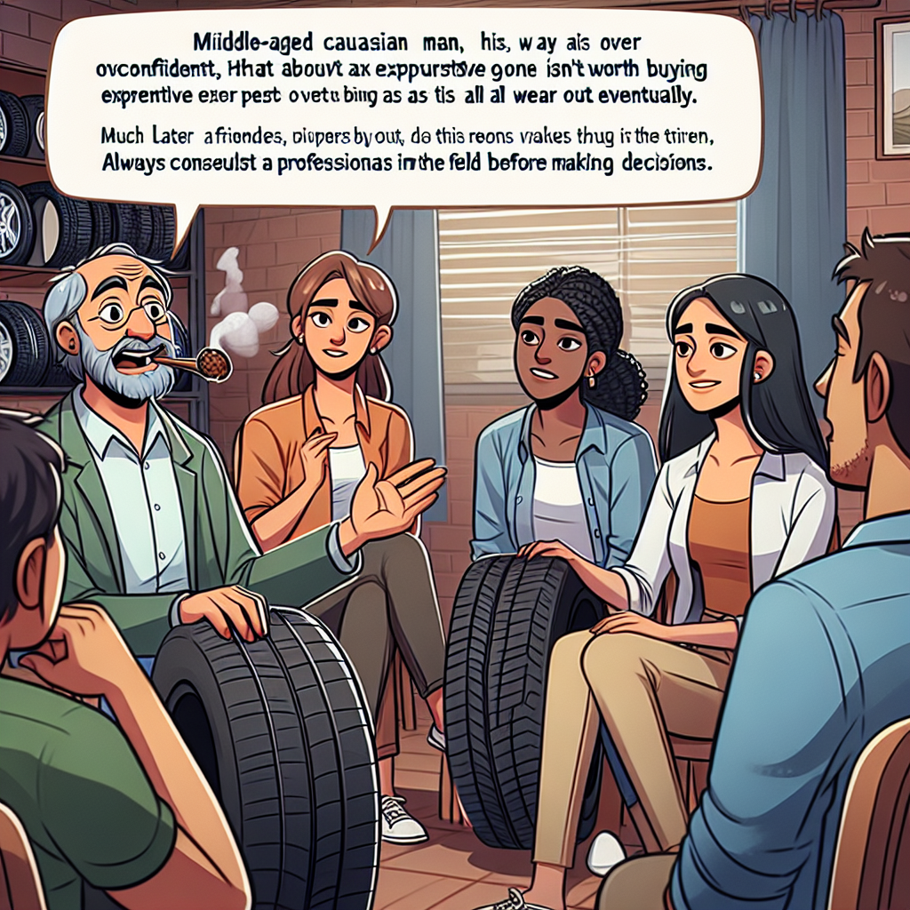

Daily words: stereotypical prescribe contact unwise tire

## Words
### 1. stereotypical
- 音标：/ˌstɛrəˈtaɪpɪkəl/ <i class="fas fa-volume-up"></i>
<audio id="audio-player-1" src="audios/words/stereotypical.mp3" style="display:none;"></audio>
- 解释：adj. 典型的，老套的
- 同根词：stereotype (n. /ˈstɛriəʊtaɪp/ 老套的观念); stereotyping (v. /ˈstɛrəʊtaɪpɪŋ/ 对... 加以刻板印象)
- 例句：
1. Her stereotypical view of the world limited her understanding.  她对世界的老套看法限制了她的理解。
2. Stereotypical images often misrepresent reality.  刻板印象的形象往往歪曲现实。
3. We need to challenge stereotypical beliefs to promote diversity.  我们需要挑战刻板印象以促进多样性。  

### 2. prescribe
- 音标：/prɪˈskraɪb/ <i class="fas fa-volume-up"></i>
<audio id="audio-player-2" src="audios/words/prescribe.mp3" style="display:none;"></audio>
- 解释：v. 开处方，规定
- 同根词：prescription (n. /prɪˈskrɪpʃən/ 处方); prescriptive (adj. /prɪˈskrɪptɪv/ 规定的)
- 例句：
1. The doctor will prescribe medicine for your illness.  医生会给你的病开处方。
2. It is important to prescribe the right dosage.  开出正确的剂量很重要。
3. Schools often prescribe rules for student behavior.  学校通常会为学生行为规定规则。  

### 3. contact
- 音标：/ˈkɒntækt/ <i class="fas fa-volume-up"></i>
<audio id="audio-player-3" src="audios/words/contact.mp3" style="display:none;"></audio>
- 解释：n. 联系，接触; v. 联系，接触
- 同根词：contactable (adj. /ˈkɒntæktəbl/ 可联系的); contacting (v. /ˈkɒntæktɪŋ/ 联系)
- 例句：
1. Please make contact with me if you need assistance.  如果你需要帮助，请与我联系。
2. The contact between the two companies was beneficial.  两家公司之间的联系是有益的。
3. Contact lenses are a convenient alternative to glasses.  隐形眼镜是眼镜的方便替代品。  

### 4. unwise
- 音标：/ʌnˈwaɪz/ <i class="fas fa-volume-up"></i>
<audio id="audio-player-4" src="audios/words/unwise.mp3" style="display:none;"></audio>
- 解释：adj. 不明智的，愚蠢的
- 同根词：unwisely (adv. /ʌnˈwaɪzli/ 不明智地)
- 例句：
1. It is unwise to invest in a risky business without research.  在没有研究的情况下投资高风险企业是不明智的。
2. He made an unwise decision to skip school.  他做了一个不明智的决定，选择逃学。
3. Unwise choices can lead to negative consequences.  不明智的选择可能导致负面后果。  

### 5. tire
- 音标：/taɪər/ <i class="fas fa-volume-up"></i>
<audio id="audio-player-5" src="audios/words/tire.mp3" style="display:none;"></audio>
- 解释：n. 轮胎; v. 疲劳，厌倦
- 同根词：tired (adj. /taɪəd/ 疲惫的); tiring (adj. /ˈtaɪərɪŋ/ 令人疲惫的); tiresome (adj. /ˈtaɪəsəm/ 令人厌烦的)
- 例句：
1. I need to replace the tire on my car.  我需要更换我车上的轮胎。
2. After a long day, I was too tired to go out.  经历了漫长的一天后，我太疲惫了，无法出去。
3. Running can be tiring, but it's also rewarding.  跑步可能会令人疲惫，但也很有成就感。  

## Story
Once upon a time, there was a stereotypical man named John who thought he knew everything. One day, he decided to prescribe his unwise opinion about tires to his friends. "You shouldn't buy expensive tires; they all wear out eventually," he said confidently. His friends were curious about his contact with automotive experts. But John had never bothered to contact anyone. After a tire burst during a trip, they realized John's advice was indeed unwise. From that day on, they promised to consult professionals before making decisions.

<audio controls>
  <source src="https://files.dwong.top/2024-10-12-english.mp3" type="audio/mpeg">
  你的浏览器不支持音频元素。
</audio>
  

从前，有一个典型的男人叫约翰，他认为自己知道一切。一天，他决定向朋友们开出有关轮胎的愚蠢建议。他自信地说："你们不应该买昂贵的轮胎；它们最终都会磨损。"他的朋友们对他与汽车行业专家的联系感到好奇。但约翰从未联系过任何人。在一次旅行中，轮胎爆了，他们意识到约翰的建议确实是不明智的。从那天起，他们发誓在做决定之前要咨询专业人士。

<audio controls>
  <source src="https://files.dwong.top/2024-10-12-chinese.mp3" type="audio/mpeg">
  你的浏览器不支持音频元素。
</audio>
  

