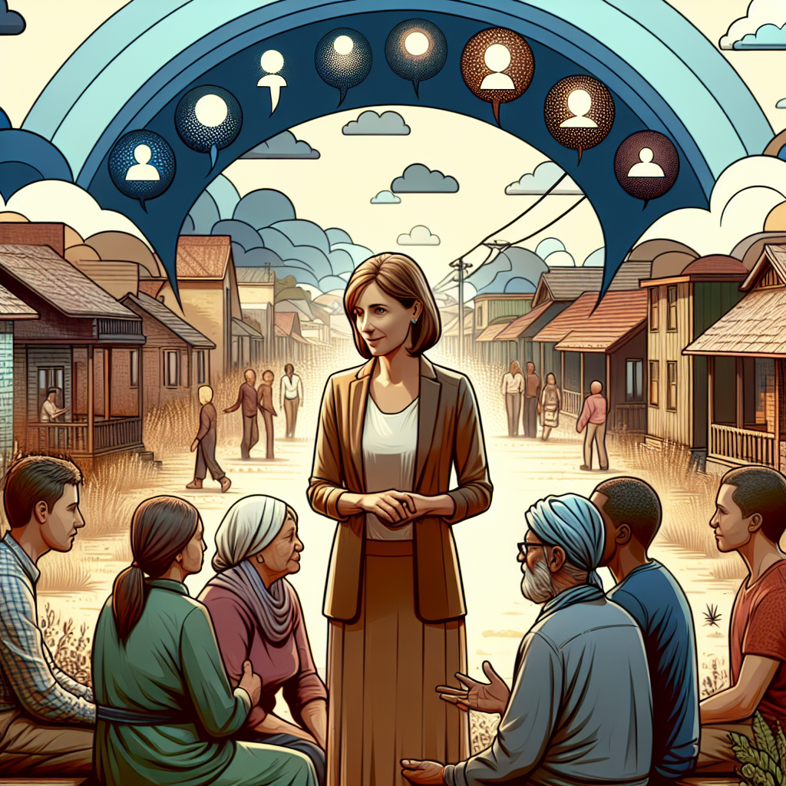

Daily words: counsellor systematically channel revelation villager

## Words
### 1. counsellor
- 音标：/ˈkaʊn.sə.lər/ <i class="fas fa-volume-up"></i>
<audio id="audio-player-1" src="audios/words/counsellor.mp3" style="display:none;"></audio>
- 解释：n. 顾问；辅导员
- 同根词：counsel (n. /ˈkaʊn.səl/; 法律顾问)，counseling (n. /ˈkaʊn.sə.lɪŋ/; 辅导)
- 例句：
1. The school counsellor helps students with their problems.
2. As a professional counsellor, she provides guidance to families in need.
3. They sought the advice of a community counsellor to resolve their issues.

### 2. systematically
- 音标：/ˌsɪs.təˈmæt.ɪ.kli/ <i class="fas fa-volume-up"></i>
<audio id="audio-player-2" src="audios/words/systematically.mp3" style="display:none;"></audio>
- 解释：adv. 系统地；有条理地
- 同根词：systematic (adj. /ˌsɪs.təˈmæt.ɪk/; 系统的)，system (n. /ˈsɪs.təm/; 系统)
- 例句：
1. She approached the project systematically to avoid mistakes.
2. The research was carried out systematically over several months.
3. They systematically collected data for their study.

### 3. channel
- 音标：/ˈtʃæn.əl/ <i class="fas fa-volume-up"></i>
<audio id="audio-player-3" src="audios/words/channel.mp3" style="display:none;"></audio>
- 解释：n. 渠道；通道；v. 引导，传送
- 同根词：channeling (n. /ˈtʃæn.əl.ɪŋ/; 引导)
- 例句：
1. The river is an important channel for trade.
2. They decided to channel their efforts into community service.
3. The TV channel broadcasts educational programs.

### 4. revelation
- 音标：/ˌrev.əˈleɪ.ʃən/ <i class="fas fa-volume-up"></i>
<audio id="audio-player-4" src="audios/words/revelation.mp3" style="display:none;"></audio>
- 解释：n. 启示；揭示
- 同根词：reveal (v. /rɪˈviːl/; 揭示)
- 例句：
1. The book was a revelation about the ancient civilization.
2. Her confession was a shocking revelation to him.
3. Scientists are waiting for further revelation about the new discovery.

### 5. villager
- 音标：/ˈvɪl.ɪ.dʒər/ <i class="fas fa-volume-up"></i>
<audio id="audio-player-5" src="audios/words/villager.mp3" style="display:none;"></audio>
- 解释：n. 村民
- 同根词：village (n. /ˈvɪl.ɪdʒ/; 村庄)，villages (n. /ˈvɪl.ɪ.dʒɪz/; 村庄的复数)
- 例句：
1. The villager shared stories about the history of their land.
2. Villagers gathered in the square for the celebration.
3. Each villager plays a role in maintaining the community.

## Story
In a small village, a counsellor named Anna worked systematically to help the villagers. She believed that every revelation about their struggles could channel their energy into positive change. One day, she organized a meeting in the village square where villagers could express their concerns. As they talked, Anna listened carefully and provided guidance. The villagers felt empowered by the discussions, and their worries became lighter. Anna’s efforts transformed the village, making it a happier place.

<audio controls>
  <source src="https://files.dwong.top/2024-10-14-english.mp3" type="audio/mpeg">
  你的浏览器不支持音频元素。
</audio>
  

在一个小村庄里，一位名叫安娜的顾问系统地帮助村民们。她相信，关于他们挣扎的每一个启示都可以引导他们的精力向积极的变化转化。一天，她在村广场组织了一次会议，让村民们表达他们的担忧。在谈话中，安娜认真倾听并提供指导。村民们感受到讨论的力量，他们的担忧变得轻松。安娜的努力改变了这个村庄，使它成为一个更幸福的地方。

<audio controls>
  <source src="https://files.dwong.top/2024-10-14-chinese.mp3" type="audio/mpeg">
  你的浏览器不支持音频元素。
</audio>
  

