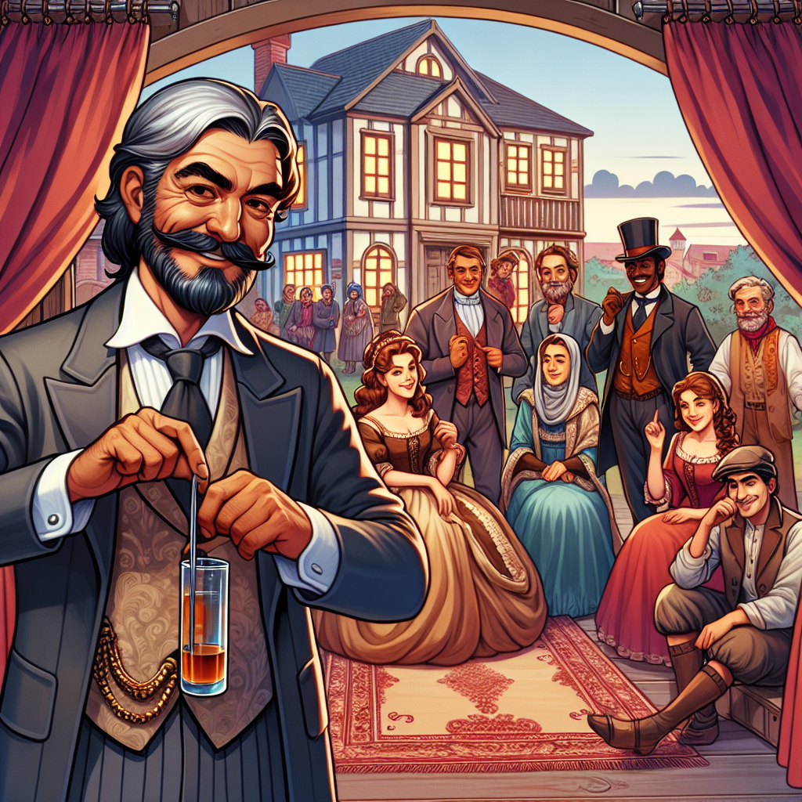

Daily words: disloyal chronic tasteful consecutive velvet

## Words
### 1. disloyal
- 音标：/dɪsˈlɔɪəl/ <i class="fas fa-volume-up"></i>
<audio id="audio-player-1" src="audios/words/disloyal.mp3" style="display:none;"></audio>
- 解释：adj. 不忠诚的
- 同根词：disloyalty (n. /dɪsˈlɔɪəlti/ 不忠诚)
- 例句：
1. He felt disloyal to his country.
他感到对自己的国家不忠诚。
2. A disloyal friend will betray you.
一个不忠诚的朋友会背叛你。
3. Disloyalty can harm relationships.
不忠诚会伤害关系。

### 2. chronic
- 音标：/ˈkrɒnɪk/ <i class="fas fa-volume-up"></i>
<audio id="audio-player-2" src="audios/words/chronic.mp3" style="display:none;"></audio>
- 解释：adj. 慢性的，长期的
- 同根词：chronically (adv. /ˈkrɒnɪkli/ 慢性地)
- 例句：
1. She suffers from chronic pain.
她遭受慢性疼痛。 
2. Chronic stress can affect your health.
长期压力会影响你的健康。 
3. He has a chronic habit of procrastination.
他有一个长期拖延的习惯。

### 3. tasteful
- 音标：/ˈteɪstfəl/ <i class="fas fa-volume-up"></i>
<audio id="audio-player-3" src="audios/words/tasteful.mp3" style="display:none;"></audio>
- 解释：adj. 雅致的，有品位的
- 同根词：tastefully (adv. /ˈteɪstfəlɪ/ 雅致地)
- 例句：
1. The decor of the restaurant is very tasteful.
这家餐厅的装修非常雅致。 
2. She dressed tastefully for the occasion.
她为这个场合打扮得很有品位。 
3. Tasteful art can enhance a room's beauty.
雅致的艺术可以提升一个房间的美感。

### 4. consecutive
- 音标：/kənˈsɛkjʊtɪv/ <i class="fas fa-volume-up"></i>
<audio id="audio-player-4" src="audios/words/consecutive.mp3" style="display:none;"></audio>
- 解释：adj. 连续的，连贯的
- 同根词：consecutively (adv. /kənˈsɛkjʊtɪvli/ 连续地)
- 例句：
1. She won the championship for three consecutive years.
她连续三年获得冠军。 
2. The team scored consecutive goals in the match.
球队在比赛中连续进球。 
3. He worked for five consecutive hours without a break.
他连续工作了五个小时没有休息。

### 5. velvet
- 音标：/ˈvɛlvɪt/ <i class="fas fa-volume-up"></i>
<audio id="audio-player-5" src="audios/words/velvet.mp3" style="display:none;"></audio>
- 解释：n. 天鹅绒; adj. 天鹅绒般的
- 同根词：velvety (adj. /ˈvɛlvəti/ 天鹅绒般的)
- 例句：
1. The dress was made of soft velvet.
这件裙子是用柔软的天鹅绒制成的。 
2. She loved the velvety texture of the fabric.
她喜欢这种天鹅绒般的面料质感。 
3. The velvet curtains added elegance to the room.
天鹅绒窗帘为房间增添了优雅。

## Story
Once upon a time, in a small town, there lived a disloyal friend named Jack. He was known for his chronic lying, which made him untrustworthy. One day, he decided to decorate his house with tasteful velvet curtains to impress his neighbors. However, in his quest for consecutive compliments, he started betraying his friends. They noticed his deceit and turned away from him. Jack learned that being disloyal only brings loneliness, and he regretted not being honest from the start.

<audio controls>
  <source src="https://files.dwong.top/2024-10-21-english.mp3" type="audio/mpeg">
  你的浏览器不支持音频元素。
</audio>
  

从前，在一个小镇上，住着一个不忠诚的朋友杰克。他因慢性撒谎而闻名，使他变得不可信。有一天，他决定用雅致的天鹅绒窗帘装饰他的房子，以取悦邻居。然而，在他追求连续赞美的过程中，他开始背叛他的朋友们。他们注意到他的欺骗，纷纷转身离开。杰克意识到不忠诚只会带来孤独，他遗憾自己一开始没有诚实对待朋友。

<audio controls>
  <source src="https://files.dwong.top/2024-10-21-chinese.mp3" type="audio/mpeg">
  你的浏览器不支持音频元素。
</audio>
  

