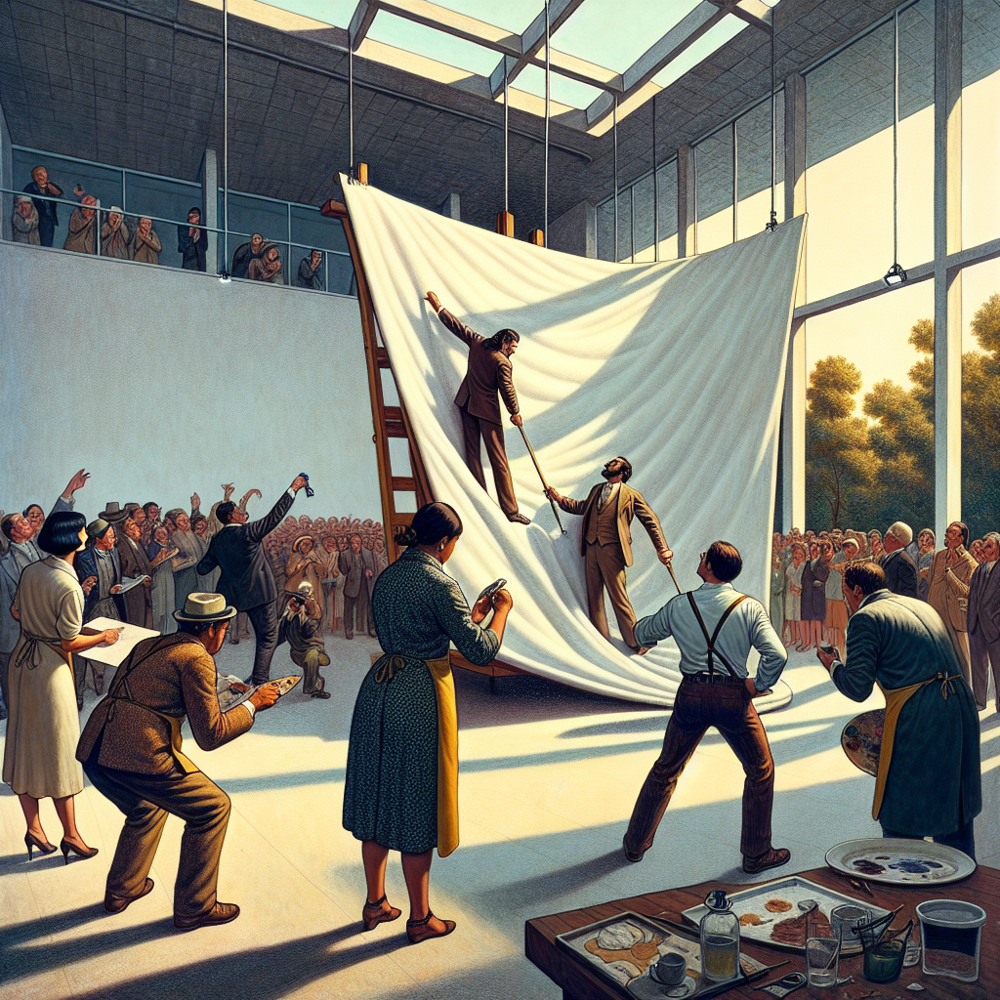

Daily words: experimental flatten stagger shade snobbish

## Words
### 1. experimental
- 音标：/ɪkˌspɛrɪˈmɛntəl/ <i class="fas fa-volume-up"></i>
<audio id="audio-player-1" src="audios/words/experimental.mp3" style="display:none;"></audio>
- 解释：adj. 实验的，试验性的
- 同根词：experiment (n. /ɪkˈspɛrɪmənt/ 实验)
- 例句：
1. The experimental design was very innovative. 
实验设计非常创新。 
2. They conducted experimental trials to test the new drug. 
他们进行了实验试验以测试新药。 
3. This artist's work is very experimental and different from the mainstream. 
这位艺术家的作品非常实验性，与主流有所不同。

### 2. flatten
- 音标：/ˈflætən/ <i class="fas fa-volume-up"></i>
<audio id="audio-player-2" src="audios/words/flatten.mp3" style="display:none;"></audio>
- 解释：v. 使平坦，变平
- 同根词：flat (adj. /flæt/ 平坦的)
- 例句：
1. The workers will flatten the ground before building. 
工人在建房子之前会把地面弄平。 
2. She tried to flatten the wrinkles in her dress. 
她试图抚平裙子上的皱纹。 
3. The car accident caused the tire to flatten. 
车祸导致轮胎瘪了。

### 3. stagger
- 音标：/ˈstæɡər/ <i class="fas fa-volume-up"></i>
<audio id="audio-player-3" src="audios/words/stagger.mp3" style="display:none;"></audio>
- 解释：v. 摇晃，蹒跚，错开
- 同根词：staggered (adj. /ˈstæɡərd/ 错开的)
- 例句：
1. He began to stagger after drinking too much. 
他喝多了之后开始蹒跚而行。 
2. The schedule was staggered to avoid overcrowding. 
时间表是错开的，以避免拥挤。 
3. I could see her stagger as she walked on the uneven path. 
我能看到她在不平坦的小路上走路时摇晃。

### 4. shade
- 音标：/ʃeɪd/ <i class="fas fa-volume-up"></i>
<audio id="audio-player-4" src="audios/words/shade.mp3" style="display:none;"></audio>
- 解释：n. 阴影，阴凉处; v. 遮蔽，投阴影
- 同根词：shaded (adj. /ˈʃeɪdɪd/ 有阴影的)
- 例句：
1. The tree provided shade on a hot day. 
树木在炎热的日子里提供了阴凉。 
2. She used a lamp to shade her eyes from the bright light. 
她用灯光遮挡住自己眼睛的强光。 
3. The artist painted in shades of blue and green. 
艺术家用蓝色和绿色的阴影作画。

### 5. snobbish
- 音标：/ˈsnɔːbɪʃ/ <i class="fas fa-volume-up"></i>
<audio id="audio-player-5" src="audios/words/snobbish.mp3" style="display:none;"></audio>
- 解释：adj. 自大的，势利的
- 同根词：snob (n. /snɒb/ 势利的人)
- 例句：
1. His snobbish attitude made it hard for him to make friends. 
他自大的态度让他很难交朋友。 
2. The snobbish behavior of some guests was surprising. 
一些客人的势利行为令人惊讶。 
3. She always looked down on people who didn’t share her tastes. 
她总是看不起那些不分享她品味的人。

## Story
In an experimental art gallery, a snobbish artist displayed his new work. He wanted everything to be perfect, so he insisted that the assistants flatten the canvas before hanging it. However, the canvas was so large that it started to stagger as it was lifted. Visitors admired the artwork, enjoying the shade provided by the trees outside. Yet, the artist, lost in his own world, paid no attention to their appreciation.

<audio controls>
  <source src="./audios/story/2024-10-22-english.mp3" type="audio/mpeg">
  你的浏览器不支持音频元素。
</audio>
  

在一个实验艺术画廊里，一位自大的艺术家展出了他的最新作品。他想要一切完美，于是坚持让助手在挂画之前把画布弄平。然而，由于画布太大，它在抬起时开始摇晃。游客们欣赏着艺术品，享受着外面树木带来的阴凉。然而，艺术家却沉浸在自己的世界里，完全没有注意到他们的赞赏。

<audio controls>
  <source src="./audios/story/2024-10-22-chinese.mp3" type="audio/mpeg">
  你的浏览器不支持音频元素。
</audio>
  

