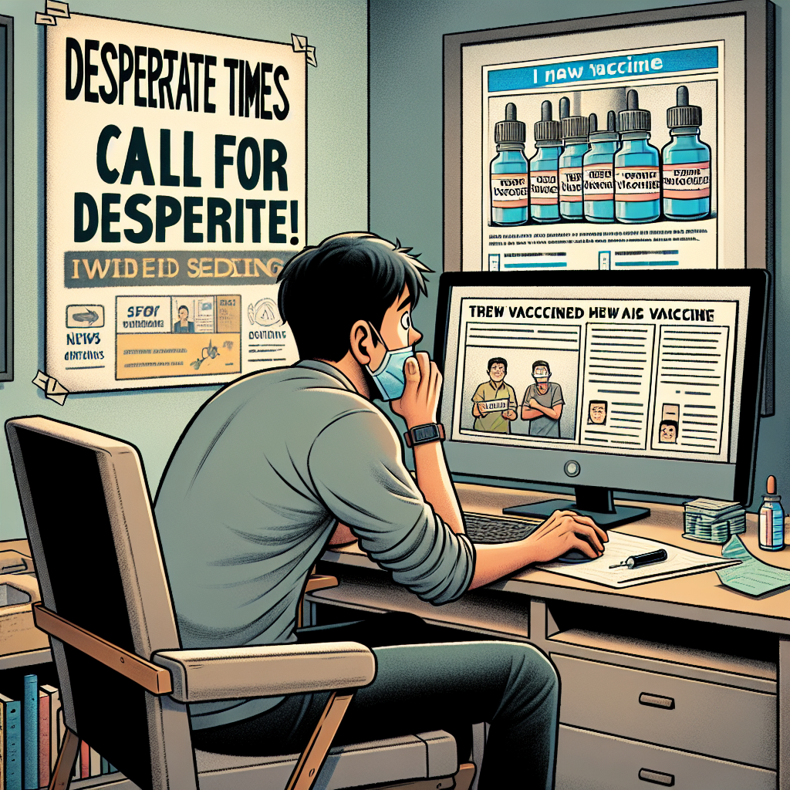

Daily words: hang ironically vaccine desperate filter

## Words
### 1. hang
- 音标：/hæŋ/ <i class="fas fa-volume-up"></i>
<audio id="audio-player-1" src="audios/words/hang.mp3" style="display:none;"></audio>
- 解释：v. 悬挂；吊；垂下
- 同根词：hanging (n. /ˈhæŋɪŋ/, 悬挂；吊死)
- 例句：
1. He decided to hang the picture on the wall. 
他决定把画挂在墙上。
2. The laundry was hanging outside to dry. 
洗好的衣服挂在外面晾干。
3. She felt like she was hanging by a thread. 
她感觉自己像是悬在一根线上。

### 2. ironically
- 音标：/aɪˈrɒnɪkli/ <i class="fas fa-volume-up"></i>
<audio id="audio-player-2" src="audios/words/ironically.mp3" style="display:none;"></audio>
- 解释：adv. 讽刺地；出乎意料地
- 同根词：ironic (adj. /aɪˈrɒnɪk/, 讽刺的)
- 例句：
1. Ironically, he won the race despite his injuries. 
讽刺的是，尽管受伤，他还是赢得了比赛。
2. She laughed ironically at the situation. 
她对这种情况嘲讽地笑了。
3. It was ironically the worst possible time to ask for help. 
讽刺的是，那是请求帮助的最糟糕时机。

### 3. vaccine
- 音标：/vækˈsiːn/ <i class="fas fa-volume-up"></i>
<audio id="audio-player-3" src="audios/words/vaccine.mp3" style="display:none;"></audio>
- 解释：n. 疫苗
- 例句：
1. The vaccine will help prevent the spread of the disease. 
这个疫苗将有助于防止疾病的传播。
2. Many people are hesitant to get the vaccine. 
许多人对接种疫苗持迟疑态度。
3. Vaccines have saved millions of lives over the years. 
多年来，疫苗拯救了数百万人的生命。

### 4. desperate
- 音标：/ˈdɛspərɪt/ <i class="fas fa-volume-up"></i>
<audio id="audio-player-4" src="audios/words/desperate.mp3" style="display:none;"></audio>
- 解释：adj. 绝望的；铤而走险的
- 同根词：desperation (n. /ˌdɛspəˈreɪʃən/, 绝望)
- 例句：
1. She was in a desperate situation and needed help. 
她处于绝望的境地，需要帮助。
2. Desperate times call for desperate measures. 
绝望时刻需要铤而走险的措施。
3. He made a desperate plea for his friend’s safety. 
他绝望地请求保护他的朋友安全。

### 5. filter
- 音标：/ˈfɪltər/ <i class="fas fa-volume-up"></i>
<audio id="audio-player-5" src="audios/words/filter.mp3" style="display:none;"></audio>
- 解释：v. 过滤；n. 过滤器
- 同根词：filtering (n. /ˈfɪltərɪŋ/, 过滤)
- 例句：
1. You need to filter the water before drinking it. 
你需要在饮用之前过滤水。
2. The filter removed all the impurities. 
过滤器去除了所有杂质。
3. She decided to filter through the information carefully. 
她决定仔细过滤信息。

## Story
In a desperate situation, a man decided to filter through the news about a new vaccine. Ironically, he had just hung a poster that read, 'Stay safe!' but was now questioning how safe he really was. The information was confusing; some said the vaccine was effective, while others had concerns. He felt he was hanging by a thread, trying to make the right decision. With a sigh, he remembered the wise saying: 'Desperate times call for desperate measures.' Therefore, he bravely decided to get vaccinated, hoping to protect himself and others.

<audio controls>
  <source src="./audios/story/2024-10-28-english.mp3" type="audio/mpeg">
  你的浏览器不支持音频元素。
</audio>
  

在绝望的情况下，一个男人决定过滤有关新疫苗的新闻。讽刺的是，他刚刚挂了一张写着“保持安全！”的海报，但现在他开始质疑自己究竟有多安全。信息很混乱；有人说疫苗有效，而其他人则表示担忧。他感觉自己像是悬在一根线上，努力做出正确的决定。叹了口气，他想起了那句智慧的话：“绝望时刻需要铤而走险的措施。”因此，他勇敢地决定接种疫苗，希望能保护自己和他人。

<audio controls>
  <source src="./audios/story/2024-10-28-chinese.mp3" type="audio/mpeg">
  你的浏览器不支持音频元素。
</audio>
  

