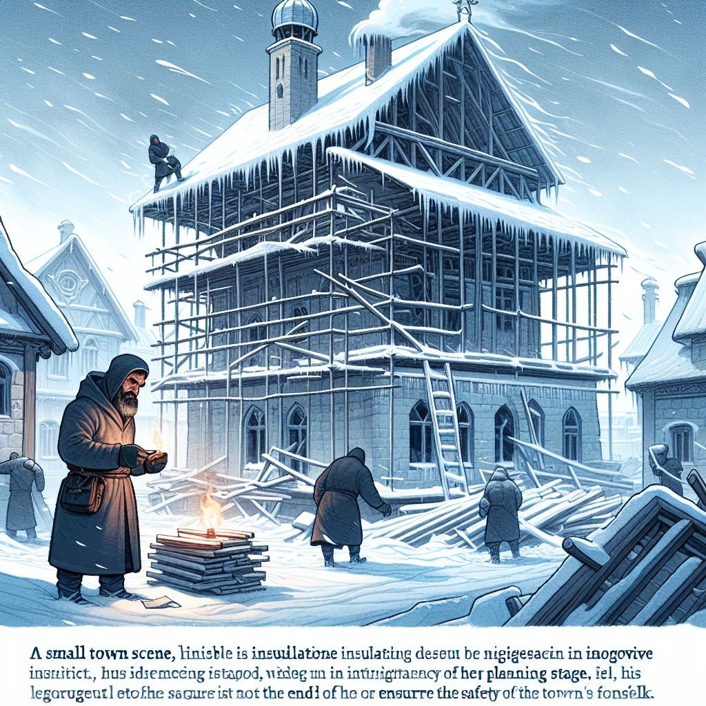

Daily words: negligence icily structure integrity endeavour

## Words
### 1. negligence
- 音标：/ˈnɛɡlɪdʒəns/ <i class="fas fa-volume-up"></i>
<audio id="audio-player-1" src="audios/words/negligence.mp3" style="display:none;"></audio>
- 解释：n. 疏忽，失职
- 同根词：negligent (adj. /ˈnɛɡlɪdʒənt/ 疏忽的; negligence (n. /ˈnɛɡlɪdʒəns/ 疏忽，失职)
- 例句：
1. The company's negligence caused a serious accident.
这家公司的疏忽导致了一起严重的事故。
2. She was found guilty of negligence in her duties.
她因工作中的失职被判有罪。
3. The doctor faced consequences for his negligence towards the patient.
医生因对病人的疏忽而面临后果。

### 2. icily
- 音标：/ˈaɪsəli/ <i class="fas fa-volume-up"></i>
<audio id="audio-player-2" src="audios/words/icily.mp3" style="display:none;"></audio>
- 解释：adv. 冷淡地，冰冷地
- 同根词：icy (adj. /ˈaɪsi/ 冰冷的，冷淡的)
- 例句：
1. He looked at her icily after the argument.
争吵后，他冷淡地看着她。
2. The weather turned icily cold overnight.
天气在一夜之间变得冰冷。
3. She responded icily to his attempts at humor.
她对他试图开玩笑的反应很冷淡。

### 3. structure
- 音标：/ˈstrʌk.tʃər/ <i class="fas fa-volume-up"></i>
<audio id="audio-player-3" src="audios/words/structure.mp3" style="display:none;"></audio>
- 解释：n. 结构，构造; v. 构造，组织
- 同根词：structural (adj. /ˈstrʌk.tʃər.əl/ 结构的; destruct (v. /dɪˈstrʌkt/ 破坏)
- 例句：
1. The structure of the building is quite complex.
这座建筑的结构相当复杂。
2. We need to structure our presentation effectively.
我们需要有效地组织我们的演示。
3. The tree's structure allowed it to withstand strong winds.
这棵树的结构使它能够抵御强风。

### 4. integrity
- 音标：/ɪnˈtɛɡrɪti/ <i class="fas fa-volume-up"></i>
<audio id="audio-player-4" src="audios/words/integrity.mp3" style="display:none;"></audio>
- 解释：n. 完整性，正直; n. 整体性
- 同根词：integrate (v. /ˈɪn.tɪ.ɡreɪt/ 整合; integration (n. /ˌɪn.tɪˈɡreɪ.ʃən/ 整合)
- 例句：
1. His integrity is admired by all his colleagues.
他的正直受到所有同事的钦佩。
2. The integrity of the data is crucial for the research.
数据的完整性对研究至关重要。
3. Maintaining integrity in business is essential for long-term success.
在商业中保持正直对长期成功至关重要。

### 5. endeavour
- 音标：/ɪnˈdɛvər/ <i class="fas fa-volume-up"></i>
<audio id="audio-player-5" src="audios/words/endeavour.mp3" style="display:none;"></audio>
- 解释：v. 努力，尽力; n. 尝试，努力
- 同根词：endeavor (n. /ɪnˈdɛvər/ 努力，尽力)
- 例句：
1. She will endeavour to finish the project on time.
她会努力按时完成这个项目。
2. His latest endeavour has received much praise.
他最近的努力得到了很多赞扬。
3. We should not shy away from new endeavours.
我们不应该害怕新的尝试。

## Story
In a small town, an architect was known for his integrity and innovative structure designs. One day, a building he constructed faced issues due to negligence during the planning stage. The cold winter winds blew icily through the cracks, causing alarm among residents. Determined to resolve the problem, the architect decided to endeavour to fix the building. He worked tirelessly and, in the end, his efforts paid off. The structure was made safe again, and the town appreciated his dedication.

<audio controls>
  <source src="./audios/story/2024-11-03-english.mp3" type="audio/mpeg">
  你的浏览器不支持音频元素。
</audio>
  

在一个小镇上，一位建筑师因其正直和创新的结构设计而闻名。一天，他建造的一座建筑因规划阶段的疏忽而出现问题。寒冷的冬风冰冷地吹过裂缝，引起居民的恐慌。为了全力解决这个问题，建筑师决定努力修复这座建筑。他不知疲倦地工作，最终，他的努力得到了回报。结构再次变得安全，小镇上人们对他的奉献表示感激。

<audio controls>
  <source src="./audios/story/2024-11-03-chinese.mp3" type="audio/mpeg">
  你的浏览器不支持音频元素。
</audio>
  

