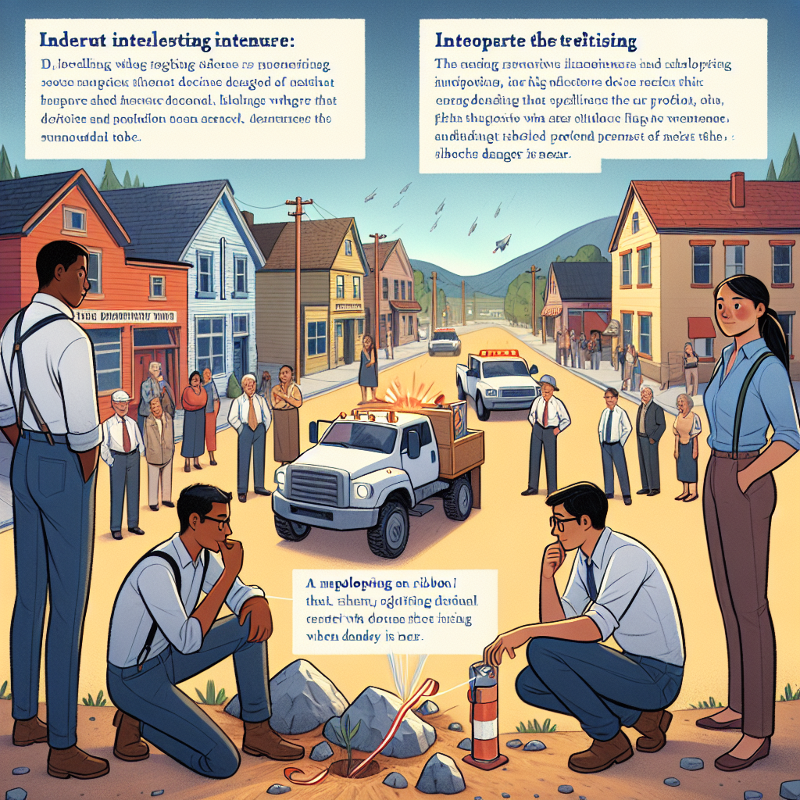

Daily words: devise ribbon pragmatic explosive rock

## Words
### 1. devise
- 音标：/dɪˈvaɪz/ <i class="fas fa-volume-up"></i>
<audio id="audio-player-1" src="audios/words/devise.mp3" style="display:none;"></audio>
- 解释：v. 设计，发明；策划
- 同根词：device n. /dɪˈvaɪs/ 设备；装置; devisable adj. /dɪˈvaɪzəbl/ 可设计的
- 例句：
1. She needs to devise a new plan for the project.
她需要为这个项目设计一个新计划。
2. They devised an innovative solution to the problem.
他们想出了一个创新的解决方案。
3. The team worked together to devise a strategy.
团队合作设计了一项策略。

### 2. ribbon
- 音标：/ˈrɪbən/ <i class="fas fa-volume-up"></i>
<audio id="audio-player-2" src="audios/words/ribbon.mp3" style="display:none;"></audio>
- 解释：n. 带，丝带；色带
- 同根词：ribboned adj. /ˈrɪbənd/ 装饰带状的; ribbony adj. /ˈrɪbəni/ 像丝带的
- 例句：
1. She tied her hair with a colorful ribbon.
她用一条彩色丝带绑了头发。
2. The gift was wrapped in a beautiful ribbon.
礼物用美丽的丝带包装。 
3. The award was adorned with a golden ribbon.
奖项上装饰着金色丝带。

### 3. pragmatic
- 音标：/præɡˈmætɪk/ <i class="fas fa-volume-up"></i>
<audio id="audio-player-3" src="audios/words/pragmatic.mp3" style="display:none;"></audio>
- 解释：adj. 实际的，务实的
- 同根词：pragmatism n. /ˈpræɡmətɪzəm/ 实用主义; pragmatist n. /ˈpræɡmətɪst/ 实用主义者; pragmatically adv. /præɡˈmætɪkli/ 实际上; 务实地
- 例句：
1. She took a pragmatic approach to solving the issue.
她采取了务实的方法来解决这个问题。
2. Pragmatic thinking is essential in business.
务实的思维在商业中至关重要。
3. His decisions are always pragmatic and well thought out.
他的决定总是务实且经过深思熟虑。

### 4. explosive
- 音标：/ɪkˈsploʊsɪv/ <i class="fas fa-volume-up"></i>
<audio id="audio-player-4" src="audios/words/explosive.mp3" style="display:none;"></audio>
- 解释：adj. 爆炸的，爆炸性强的；n. 炸药
- 同根词：explosion n. /ɪkˈsploʊʒən/ 爆炸; explosively adv. /ɪkˈsploʊsɪvli/ 爆炸性地; explosiveness n. /ɪkˈsploʊsɪvnɪs/ 爆炸性
- 例句：
1. The explosive device was found by the police.
警方发现了爆炸装置。
2. The situation became explosive after the announcement.
宣布后情况变得紧张。 
3. He had an explosive personality, often losing his temper.
他的性格很爆炸，常常发脾气。

### 5. rock
- 音标：/rɒk/ <i class="fas fa-volume-up"></i>
<audio id="audio-player-5" src="audios/words/rock.mp3" style="display:none;"></audio>
- 解释：n. 岩石，石头；v. 摇晃，震动
- 同根词：rocky adj. /ˈrɒki/ 多岩石的; rocked v. /rɒkt/ 摇晃过的; rocking v. /ˈrɒkɪŋ/ 摇摆的
- 例句：
1. The rock was too heavy to lift.
这块岩石太重了，无法搬动。
2. The boat began to rock on the waves.
船在波浪中开始摇晃。
3. He found a smooth rock to skip across the water.
他找到了一块光滑的石头在水面上打水漂。

## Story
In a small town, a team of engineers was working on a device that could detect explosives. They needed to devise a way to make it more practical, so they decided to include a ribbon that would signal when danger was near. The project was becoming quite explosive, attracting attention from nearby towns. One day, while testing, they discovered a rocky area that could serve as a perfect testing ground for their invention. Everyone was eager to see how it would perform in real situations. After much preparation, they were ready to rock the world with their innovation!

<audio controls>
  <source src="./audios/story/2024-11-05-english.mp3" type="audio/mpeg">
  你的浏览器不支持音频元素。
</audio>
  

在一个小镇上，一组工程师正在研发一种可以探测炸药的装置。他们需要设计一个更加实用的方法，于是决定加入一条丝带，用来在危险临近时发出信号。这个项目变得非常引人注目，吸引了周边城镇的关注。一天，在测试过程中，他们发现了一个岩石区域，可以作为他们发明的理想测试场地。每个人都渴望看到它在实际情况中的表现。经过多次准备，他们准备凭借自己的创新改变世界！

<audio controls>
  <source src="./audios/story/2024-11-05-chinese.mp3" type="audio/mpeg">
  你的浏览器不支持音频元素。
</audio>
  

